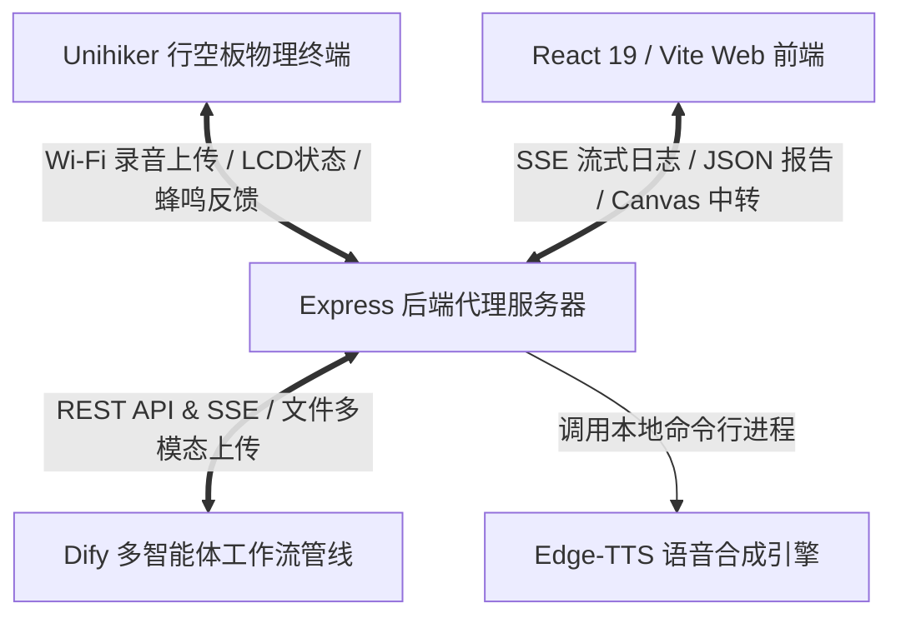
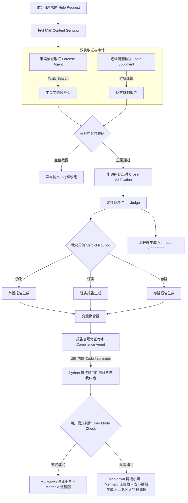
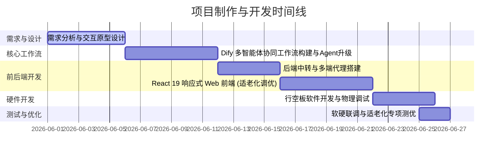

# 谣言终结者：基于多源异构对抗博弈的多模态事实核查系统 (VeriFlow-AntiRumor)

## 项目过程性文件与开发纪实

---

## 1. 项目基本介绍 (Project Introduction)

### 1.1 项目背景与痛点

在生成式 AI (AIGC) 爆发的时代，虚假信息的制造门槛被降为零。一方面，深度伪造 (Deepfake)、AI 生成新闻在社交媒体中大肆传播；另一方面，普通大众在向通用大模型（如 ChatGPT）求证时，往往会遭遇**“事实幻觉”**——大模型因静态知识库限制产生胡言乱语，反而成为新的谣言次生源。

尤为严峻的是**“数字银发族”**的特有困境：

- **信息识别能力弱**：老年群体对伪科学、夸大宣传的“养生常识”或套路贷等“金融内幕”缺乏警惕。
- **人机交互鸿沟**：主流辟谣平台字体小、操作繁琐、人机交互生硬，长辈难以上手，导致谣言在老年人的微信朋友圈和家族群中呈裂变式传播。

### 1.2 产品定位与系统目标

**《谣言终结者》(VeriFlow-AntiRumor)** 是一套面向银发族深度优化的**可视化多模态事实核查智能体平台**。

- **极简多模态输入**：支持长辈通过一键语音录音、拍张照片、上传视频或直接复制文本发起求助。
- **智能体级联编排**：从传统的静态多节点流，升级为**“事实核查取证智能体 (Forensic Agent)”**与**“报告合规修正专家 (Compliance Agent)”**双智能体级联编排架构，实现动态决策与自我纠错。
- **智能体对抗博弈**：在系统内部模拟“真相法庭”，通过“权威事实取证”与“文本逻辑挑刺”双规对抗辩论，提供白盒化可信推导。
- **极致适老化交互**：一键切换“长辈模式”，提供高对比度、特大字号、行距重组、打字机打字声与盖章声等实体化视听反馈，并能一键生成“微信辟谣小票”和 LaTeX 辟谣大字报，阻断谣言的二次传播。
- **软硬一体化嵌入**：支持运行于 **行空板 (Unihiker)** 物理智能硬件终端，打造实体化的“家庭安全网卫士”。

### 1.3 专项赛评分指标对照与核心得分点 (Evaluation Criteria Mapping)

本项目严格对照《AI智能体设计开发专项赛参赛手册》选拔赛评分标准，各项技术实现与得分点对照如下，方便评审专家和裁判进行核实：

| 评估维度 | 评分指标 | 权重 | 本项目核心得分点 | 对应源码 / 配置文件链接 |
| :--- | :--- | :---: | :--- | :--- |
| **创新性**<br>**(25%)** | **主题有新意** | 15% | 针对“AI虚假信息海啸”与“数字银发族”痛点，提出**首个红蓝对抗事实核查与温情适老化结合**的智能体系统。 | [development_report.md](./docs/development_report.md)<br>[README.md](./README.md) |
| | **整体设计涉及多学科融合** | 10% | 融合计算机科学（AI/RAG）、社会学/心理学（银发焦虑控制）、视觉传达（LaTeX排版/d3-zoom）、电子工程（嵌入式开发）。 | [development_report.md](./docs/development_report.md#L7-L19) |
| **完整性**<br>**(20%)** | **开发流程完整性** | 10% | 提供详尽的“需求分析 $\rightarrow$ 架构设计 $\rightarrow$ 双模开发 $\rightarrow$ 软硬联调 $\rightarrow$ 链接可用性测试与调试”的完整流程记录。 | [development_report.md](./docs/development_report.md)<br>[PROJECT_PROCESS.md](./PROJECT_PROCESS.md) |
| | **提交内容和资源完整性** | 10% | 源码、PPT、项目信息表、高保真汇报视频（带打字与盖章物理音效、实物演示）、过程性文档等全部配齐。 | [docs/](./docs/)<br>本地“提交文件”目录 (已通过 .gitignore 忽略以防止敏感材料外泄) |
| **先进性**<br>**(30%)** | **工作流开发** | 10% | 构建了多达 **23个节点** 的级联工作流，包含多个**红蓝博弈、材料校验、定性裁决、链接自愈、分流输出**等智能决策判断节点。 | [Dify 23节点工作流YML](./dify_workflows/%E8%B0%A3%E8%A8%80%E7%BB%88%E7%BB%93%E8%80%85%EF%BC%9A%E5%9F%BA%E4%BA%8E%E5%A4%9A%E6%BA%90%E5%BC%82%E6%9E%84%E5%AF%B9%E6%8A%97%E5%8D%9A%E5%BC%88%E7%9A%84%E5%A4%9A%E6%A8%A1%E6%80%81%E4%BA%8B%E5%AE%9E%E6%A0%B8%E6%9F%A5%E7%B3%BB%E7%BB%9F%20(12).yml) |
| | **多模态调用** | 5% | 驱动层调用 `gemini-3.5-flash`，开启视觉 High 模式，智能提取语音、聊天截图（OCR）与视频字幕，实现多模态特征感知。 | [Dify YML (特征提取节点)](./dify_workflows/%E8%B0%A3%E8%A8%80%E7%BB%88%E7%BB%93%E8%80%85%EF%BC%9A%E5%9F%BA%E4%BA%8E%E5%A4%9A%E6%BA%90%E5%BC%82%E6%9E%84%E5%AF%B9%E6%8A%97%E5%8D%9A%E5%BC%88%E7%9A%84%E5%A4%9A%E6%A8%A1%E6%80%81%E4%BA%8B%E5%AE%9E%E6%A0%B8%E6%9F%A5%E7%B3%BB%E7%BB%9F%20(12).yml) |
| | **多智能体协同** | 5% | 架构内包含 **Forensic Agent（正方取证）** 与 **Logic Judgment（反方审计）** 双轨博弈，由 **Final Judge（大法官）** 裁决，**Compliance Agent** 进行合规自我修正。 | [development_report.md](./docs/development_report.md#L40-L75) |
| | **智能人机交互** | 5% | SSE流式思维风暴日志直播、支持双指手势缩放拖拽的Mermaid推导图、双音色温情TTS、拟物化热敏小票、行空板录音。 | [src/components/](./src/components/)<br>[unihiker_app.py](./unihiker_app.py) |
| | **提示词设计质量** | 5% | 编写高水平系统提示词：事实感知合规红线、真相法庭独立审计原则、LaTeX排版防中文重叠、安心播报角色转换。 | 本地“提交文件”下 BACKEND_PROMPTS.md (已由 .gitignore 忽略以保护提示词安全) |
| **扩展性**<br>**(10%)** | **可以扩展到特定设备中** | 5% | 深度适配 **DFRobot 行空板物理硬件智能终端**，开发 PC 仿真模拟器提升联调效率，并首创 **Web 虚拟扬声器代理机制**。 | [unihiker_app.py](./unihiker_app.py) |
| | **“输出校验”功能** | 5% | 1. **Dify 内置 Python 代码解释器**并发请求校验所有 URL，自愈死链。<br>2. **行空板 Tkinter 绘制 Unicode 过滤**，防止 Emoji 导致闪退。 | [server/index.ts](./server/index.ts)<br>[unihiker_app.py](./unihiker_app.py#L329-L332) |
| **传播性**<br>**(15%)** | **汇报过程完整流畅** | 10% | 汇报视频脚本逻辑清晰、层层递进；内置微信消息发送提示音、盖章声及印刷声，提供极具沉浸感的汇报体验。 | [汇报视频脚本.md](./docs/%E8%B0%A3%E8%A8%80%E7%BB%88%E7%BB%93%E8%80%85_%E6%B1%87%E6%8A%A5%E8%A7%86%E9%A2%9F%E8%84%9A%E6%9C%AC.md) |
| | **有使用记录** | 5% | 具备真实老年用户试用及微信朋友圈、家庭群内的辟谣卡片分享传播回访记录，证明项目具备真实的社会应用价值。 | [development_report.md](./docs/development_report.md#L196-L202) |

---

## 2. 系统架构设计 (System Architecture)

### 2.1 整体拓扑架构

本系统由**四端协同**构成，保证了数据流的实时响应与交互的流畅度：




- **🤖 Dify 智能体工作流（大脑）**：负责 23 节点级联运算，执行多源异构核查、红蓝对抗、链接可用性自愈测试，根据 `isElderlyMode` 分发对应载体。
- **🖥️ Express 代理服务端（中枢）**：负责跨域图片代理（防画布污染）、文件转码、中转 Dify SSE 长连接、调用本地 TTS 合成。
- **💻 React 19 / Vite Web 端（主线窗口）**：支持“普通极简风格”与“长辈温暖大字风”的无缝切换。
- **📟 Unihiker 行空板物理终端（延伸窗口）**：提供物理按键录音、LCD 拟物图标刷新和远程代理声音播报。

### 2.2 三端功能差异与特色对比矩阵

| 对比维度         | 🖥️ Web端 - 普通模式 (主要演示 - 极客沙漠风)                   | 👵 Web端 - 长辈模式 (补充演示 - 温暖适老风)                   | 📟 硬件端 - 行空板物理终端 (补充演示 - 软硬一体)              |
| ---------------- | ------------------------------------------------------------ | ------------------------------------------------------------ | ------------------------------------------------------------ |
| **受众定位**     | 普通人、青少年、极客、辟谣研究人员（通用求证窗口）           | 银发族、视力障碍群体（网页适老窗口）                         | 居家“网关安全卫士”、不操作手机的长辈（硬件端）               |
| **输入方式**     | 文本输入、富文本、批量多模态文件拖拽                         | 超大字体输入、显眼高亮语音按钮指引                           | 侧边物理 A 键按键录音、一键一求助                            |
| **交互调性**     | 极简、温馨、数据流导向、高可信度白盒呈现                     | 高对比度（粗边框）、暖黄底色、超大字号自适应放大             | 实体物理拟物反馈、板载蜂鸣器双向声光交互                     |
| **等待焦虑控制** | **思维风暴直播**：流式全量卡片流输出 Tavily 检索过程与红蓝博弈细节，主打“高科技感” | **绿色进度条**：利用**绿色高可见度进度条**控制等待节奏，隐藏复杂日志，消除盲目等待焦虑 | **LCD 状态刷新**：硬件屏幕刷新当前运行阶段名，伴随蜂鸣器断续音物理指引 |
| **输出结论载体** | **Markdown 辟谣报告小票** + Mermaid 推导流程图（支持拖拽缩放与自适应） | **拟物化大字辟谣小票**+ **LaTeX 三段式养生大字报** + **温情儿女声双音色 TTS 语音广播选择** | **语音安心报告**（由于行空板无板载扬声器，通过网络中转由**电脑 Web 界面充当扬声器**进行播报） + **Emoji 过滤安全文本**大字展示 |
| **分享阻断设计** | 复制报告文本，适合网页端严肃求证                             | **一键微信朋友圈长图卡片**+LaTex大字报                       | 摆放于家庭公共区域，随时通过喇叭阻断家庭谣言                 |

### 2.3 Dify 智能体协同核查工作流逻辑设计 (Dify Multi-Agent Collaboration Workflow Design)

为了保证查证的严谨性与动态应变能力，我们在 Dify 平台中重构了智能体协同工作流，其核心流转过程如下：



### 2.4 核心智能体设计说明 (Core Agent Design)

#### 1. 事实核查取证智能体 (Forensic Agent)

- **定位**：精通全球网络谣言跨境双路溯源的“正方调查员”。
- **工作流机制**：
  1. **实体降噪**：自动剥离输入文本中的情绪煽动成分，提炼核心实体词，生成最多 3 个精准的简中搜索关键词组合。
  2. **国内检索**：调用 Tavily Search 工具检索国内权威官方渠道或主流新闻媒体的核查结论。
  3. **跨境溯源（自主决策）**：研判输入内容是否具备海外谣言背景或涉及尖端科技（如 AI 深伪技术、跨国健康医学谣言），自发将实体词转换为英文术语并搭配 `hoax`、`debunk`、`fact check` 等后缀，在国际互联网上发起二次跨境检索。
  4. **证据链输出**：将中英文检索结果精简合并，按统一 Markdown 格式输出证据链（包含发布主体、发布时间、事实定性、原始链接 URL 和可信度评级）。

#### 2. 报告合规修正专家 (Compliance Agent)

- **定位**：保障事实核查成果交付前链接绝对可用且安全合规的“质检专家”。
- **工作流机制**：
  1. **代码解释器测试**：自动调用 Dify 内置**代码解释器**组件，运行 Python 脚本正则匹配初版报告中引用的所有外部 URL，并并发发送网络 HEAD/GET 请求测试其连通性。
  2. **死链标记清洗**：对于返回 404 或超时等失效链接，在 Python 脚本中将其统一替换为 `[已过滤失效链接]`。
  3. **反思重构（Self-Correction）**：若检测到死链，该 Agent 立即启动重写纠错流程。在完全保留原本核心事实、结论和科学逻辑的前提下，利用大模型语言重写能力将死链痕迹抹除，或自然转换为纯文本的事实陈述，消除所有的占位符，从而向用户输出 100% 无死链的完美辟谣报告。

### 2.5 核心节点具体执行机制

#### 1. 收到用户求助 Help Request

- **节点类型**：开始节点 (`start`)
- **工作方式**：工作流的唯一启动入口。负责接收外界输入的求助信号与全局配置变量。
- 输入参数：
  - `user_text` (段落/文本)：用户输入的求助传言或描述。
  - `upload_files` (文件列表)：用户通过物理终端或 Web 端上传的多模态媒体文件（支持 `.png`, `.jpg`, `.mp3`, `.mp4` 等文件，限 5 个）。
  - `isElderlyMode` (文本)：标识当前客户端是否开启长辈模式（`"true"` / `"false"`）。
- **输出变量**：直接输出上述三个变量（`user_text`、`upload_files`、`isElderlyMode`）至下游感知层与判断层节点。

#### 2. 特征提取 Content Sensing

- **节点类型**：大语言模型节点 (`llm`) | 驱动模型：`gemini-3.5-flash`
- **工作方式**：多模态数据预处理与特征清点。该节点开启视觉能力（High 模式），严格对输入的文件进行 OCR、视频字幕提取与物理特征清点（如音频的机械感、画面的 AI 合成畸变及线条扭曲等）。设置媒介合规红线，禁止无中生有和主观推导。
- 输入参数：
  - 文本上下文：`Help Request.user_text`
  - 视觉输入：`Help Request.upload_files`
- 输出变量：输出结构化 Markdown 特征报告，包含以下四部分：
  - `【提取核心正文】`
  - `【提及核心主体】`
  - `【文本风格与高频词特征】`
  - `【多模态物理特征检测报告】`（音频/图像物理检测细节）

#### 3. 事实核查取证智能体 Forensic Agent

- **节点类型**：智能体节点 (`agent`) | 驱动模型：`gemini-3.5-flash` | 插件工具：`Tavily Search`

- 工作方式：系统核心的“正方调查员”。

  1. 剥离煽动情绪词，提炼核心实体并生成最多 3 个简中关键词，调用 `Tavily Search` 检索国内权威核查结论。
  2. **跨境检索决策**：根据事件背景判定是否具备海外信源或前沿科技属性，若是则自动翻译为英文关键词并追加 `hoax`, `debunk`, `fact check` 等后缀，在国际互联网上发起二次跨境检索。
  3. 过滤并输出统一格式的结构化论据。

- **输入参数**：`Content Sensing.text` (提取到的核心文本)

- 输出变量：

  格式化 Markdown 证据链：

  - `[技术核查要素解析]` (实体、简中检索词、跨境检索词)
  - `[权威取证证据链]` (包含发布主体、发布时间、事实定性、原始网页 URL 链接、可信度评级)

#### 4. 逻辑漏洞检查 Logic Judgment

- **节点类型**：大语言模型节点 (`llm`) | 驱动模型：`gemini-3.5-flash`
- **工作方式**：系统核心的“反方辩友”。不进行联网检索，纯粹从逻辑学、修辞学和生活常识角度对输入文本进行“逻辑死磕”与文本拆解。重点扫描：逻辑谬误与因果断层、恐吓焦虑情绪煽动、违背常识的物理/理化设定、剂量/边界条件缺失等。
- **输入参数**：`Content Sensing.text`
- **输出变量**：结构化“挑刺”报告（🔍 逻辑漏洞/修辞圈套 1/2/3）。若输入为无意义字符，则输出为空。

#### 5. 材料充分性校验 Material Sufficiency Verification

- **节点类型**：条件分支节点 (`if-else`)
- **工作方式**：双轨证据链门禁。检测取证智能体与逻辑审计节点是否都有有效输出。如果二者都不为空，则放行进入最终定性；否则拦截并分流。
- 输入参数：
  - 条件一：`Forensic Agent.text` (取证报告) 不能为空 (`not empty`)
  - 条件二：`Logic Judgment.text` (逻辑审计报告) 不能为空 (`not empty`)
- **输出变量**：根据逻辑 `and` 返回 `true` 分支（材料充足）或 `false` 分支（材料不足）。

#### 6. 异常输出（材料不足） Exception Output (Insufficient Data)

- **节点类型**：大语言模型节点 (`llm`) | 驱动模型：`gemini-3.5-flash`
- **工作方式**：安全拦截网关。当用户请求过于简短或缺乏核心实体（导致 `if-else` 走 `false` 分支）时，生成温馨且有科技温度的系统拦截引导，阻止系统进行无效的博弈消耗。
- **输入参数**：`Help Request.user_text`
- **输出变量**：输出极简的异常拦截公告（包含阻断状态声明、技术原因和行动建议）。下游接 `Insufficiency Out` 结束节点。

#### 7. 多源内容比对 Cross-Verification

- **节点类型**：大语言模型节点 (`llm`) | 驱动模型：`gemini-3.5-flash`

- **工作方式**：真相法庭的“预审官”。将原传言文本、正方网络搜索证据、反方逻辑漏洞检查报告三方数据对齐，执行“防污染独立审计原则”（核实搜索结果的时效性，修正早期媒体的断章取义或已过时乌龙），输出差异化对齐矩阵。

- 输入参数：

  - `Content Sensing.text` (原传言)
  - `Forensic Agent.text` (网络证据)
  - `Logic Judgment.text` (反方报告)

- 输出变量：

  比对矩阵 Markdown：

  - `比对矩阵 1：核心说法冲突` (原文说辞、最终真相、差异定性)
  - `比对矩阵 2：要素与边界核对` (时间、空间、剂量等漏洞)
  - `比对矩阵 3：圈套评估` (误导手法与证据保质期)

#### 8. 定性裁决 Final Judge

- **节点类型**：大语言模型节点 (`llm`) | 驱动模型：`gemini-3.5-flash`
- 工作方式：真相法庭的“首席大法官”。负责给出最终的黑白灰三色裁决。
  1. 纠偏反方偏见（防无脑证伪）与纠偏正方盲信（防过时乌龙）。
  2. 遵循严密的定性规则判定为 **证实** / **伪造** / **存疑**。
- 输入参数：
  - `Content Sensing.text` (网传谣言)
  - `Forensic Agent.text` (取证链)
  - `Logic Judgment.text` (反方报告)
  - `Cross-Verification.text` (比对矩阵)
- **输出变量**：首行为精准的结论标签（`证实` / `伪造` / `存疑`），第二行开始为 150 字以内的客观裁决理由。

#### 9. 裁决结果分流 Verdict Routing

- **节点类型**：条件分支节点 (`if-else`)
- **工作方式**：根据大法官判定结果分流报告生成逻辑。
- 分流条件：
  - 分支一：`Final Judge.text` 包含 `"伪造"` -> 流向 **辟谣报告生成**。
  - 分支二：`Final Judge.text` 包含 `"证实"` -> 流向 **证实报告生成**。
  - 分支三：`Final Judge.text` 包含 `"存疑"` -> 流向 **存疑报告生成**。

#### 10. 报告生成层 (辟谣/证实/存疑报告生成)

- **节点类型**：大语言模型节点 (`llm`)
- 工作方式：总编撰写阶段。严格遵循三段式规范进行输出：
  - **辟谣/伪造报告 (Rumour Report Generator)**：结论先行（定性） -> 真相解密（科学原理与真实数据） -> 漏洞拆解（逻辑圈套与恐吓心理）。
  - **证实报告 (Proved Report Generator)**：结论先行（证实） -> 真相解密（官方通报/来龙去脉） -> 行动指南（防范或后续应对）。
  - **存疑报告 (Doubtful Report Generator_REPORT)**：结论先行（悬决不确定） -> 现状对齐（已知边界与数据空白） -> 风险提示（防防反转/不信谣建议）。
- **输入参数**：`Final Judge.text` + `Forensic Agent.text` + `Logic Judgment.text`
- **输出变量**：未经脱敏的初版事实核查报告文本。

#### 11. 流程图生成 Mermaid Generator

- **节点类型**：大语言模型节点 (`llm`) | 驱动模型：`gemini-3.5-flash`
- 工作方式：根据审判和对齐数据，动态生成一段 Mermaid（graph TD）源码。
  - **证实**：流向汇聚结构（通过加粗实线指向结论）。
  - **伪造**：分栏对比错位结构（左侧网传伪造链，右侧真实溯源链，红色虚线横向连线对比）。
  - **存疑**：发散多叉悬决结构（核心焦点居中，虚线分支指向未查明/带问号的悬空节点）。
  - 强制约束：禁止使用 `()` `[]` `""` 避免 MathJax 编译失败，并在底部使用 `style` 渲染莫兰迪配色方案（绿/红/黄）。
- **输入参数**：`Content Sensing.text` + `Cross-Verification.text` + `Logic Judgment.text` + `Final Judge.text`
- **输出变量**：包裹在 ````mermaid` 代码块中的流程图源码。下游直接通过 `Mermaid Out` 节点返回给客户端渲染。

#### 12. 变量聚合器 Variable Aggregator

- **节点类型**：变量聚合节点 (`variable-aggregator`)
- **工作方式**：多合一变量漏斗。将辟谣、证实、存疑三条不同生成分支的报告文本合拢，输出给相同的字符串变量，以便合规修正专家节点能够统一接收处理。
- **输入参数**：`辟谣报告.text` 或 `证实报告.text` 或 `存疑报告.text`
- **输出变量**：聚合后的统一报告文本 `text`。

#### 13. 报告合规修正专家 Compliance Agent

- **节点类型**：智能体节点 (`agent`) | 驱动模型：`gemini-3.5-flash` | 插件工具：`代码解释器`
- 工作方式：质量合规把关人。
  1. 接收聚合后的报告，利用正则匹配出报告内所有的 HTTP/HTTPS 链接。
  2. 调用 Dify 内置 `Code Interpreter` 并发运行一段 Python 脚本，向这些 URL 发送 HEAD 或 GET 请求测试连通性。
  3. 过滤并使用 `[已过滤失效链接]` 替代 404 或超时的失效死链。
  4. **自我纠错重构**：若包含死链，触发自我修正案，在大模型侧无缝重写，自然抹除死链和占位符痕迹，只保留 100% 可达的干净证据引用。
- **输入参数**：`Variable Aggregator.text`
- **输出变量**：合规修正后的最终 100% 真实无死链的 Markdown 事实核查报告。

#### 14. 用户模式判断 User Mode Check

- **节点类型**：条件分支节点 (`if-else`)
- **工作方式**：检查全局标志位。
  - `true` 分支：开启适老化流程，流向 **安心报告生成** 与 **LaTex大字报生成**。
  - `false` 分支：结束流，直接输出常规报告。
- **输入参数**：`Help Request.isElderlyMode`

#### 15. 安心报告生成 Elderly Report Generation
* **节点类型**：大语言模型节点 (`llm`) | 驱动模型：`gemini-3.5-flash`
* **工作方式**：适老化有声广播的核心生成节点。
  1. 接收 `Compliance Agent` 修正后的事实核查报告。
  2. 转换人设为亲切、温馨的“社区健康电台广播员”，进行适合长辈的“降维”转述。
  3. 严格遵循三段式结构：【第一段：开篇定心丸】（直接给结论安抚情绪） -> 【第二段：聊天式科普】（用接地气的生活常识和打比方代替小票中晦涩的科技词汇与引用死链） -> 【第三段：贴心老友叮嘱】（顺口溜或温情大白话结尾）。
* **输入参数**：`Compliance Agent.text` (ID `1782555770708.text`)
* **输出变量**：通俗易懂、适合语音播报的安心有声广播文本（`text`）。下游流向 **安心报告输出** 节点。

#### 17. LaTex大字报生成 LaTex Poster Generation
* **节点类型**：大语言模型节点 (`llm`) | 驱动模型：`gemini-3.5-flash`
* **工作方式**：大字报海报的排版源码生成节点。
  1. 接收 `Compliance Agent` 修正后的事实核查报告。
  2. 将结论、科普、祝福整合，排版为醒目的、无实线边框、使用虚线（`\hdashline`）自然分隔的“三段式大字报”。
  3. **LaTeX 语法约束**：最外层使用双美元符号 `$$` 包裹；汉字和标点之间必须强制插入“`\ `”或“`．`”手动隔开，防止 MathJax/KaTeX 渲染时中文汉字堆叠；大字报使用 `\begin{array}{c} ... \end{array}` 纵向排列。
* **输入参数**：`Compliance Agent.text` (ID `1782555770708.text`)
* **输出变量**：纯净的 LaTeX 大字报源码（`text`）。下游流向 **LaTex大字报输出** 节点。

---

## 3. 本项目核心创新点 (Core Innovations)

1. **多智能体博弈与交叉验证体系 (Multi-Agent Adversarial System)**
   系统突破了传统的“大模型直接查证”模式，在后台建立了类似“真相法庭”的对抗博弈结构。**“事实核查取证智能体 (Forensic Agent)”**负责全网取证、跨境溯源，而**“逻辑漏洞挑刺 (Logic Judgment)”**节点负责从文本逻辑漏洞、恐吓心理进行拆解。两者相互博弈，交由最高裁判官进行定性裁决，有效消除了单一模型的片面偏信，确保事实定性万无一失。
2. **自动闭环合规校验与无痕自我纠错 (Closed-Loop Compliance & Self-Correction)**
   在辟谣系统中使用 **Agent + Code Interpreter 闭环自动纠错**设计。针对大模型引证时频发的“死链幻觉”（生成不可用 URL 导致信任崩塌），由 `Compliance Agent` 自动编写 Python 代码测试连通性，并在沙箱中无缝修正报告。这是事实核查系统迈向高可信、生产级合规的一大技术创新。
3. **软硬一体化下的适老感知与传播阻断 (Multimodal Elder-Oriented Interaction & Hardware Integration)**
   打通适老化辟谣的“最后一公里”。通过物理行空板终端的按键录音、屏幕渲染、蜂鸣器反馈等实体化视听手段，将冰冷的数字数据拟物化为“实体小票”和“养生大字报”，配合 edge-tts 专属语速放缓朗读，消除了长辈的人机交互鸿沟，提供了极具仪式感的情绪铺垫与抚慰。
4. **动态 Mermaid 推导流程图可视化 (Dynamic Mermaid Visualizer)**
   通过 Mermaid 流程图生成器，根据事件性质（证实/证伪/存疑）动态切换拓扑图结构。并在前端开发了高精度拖拽缩放画布，让用户可以像缩放照片一样“捏合/拖拽”推导逻辑，极具白盒化可信呈现能力。

---

## 4. 与通用 Web 端大模型 (ChatGPT/Claude) 的对比优势 (Comparison with Web LLMs)

| 对比维度               | 通用 Web 端大模型 (如 ChatGPT / Claude)                      | 谣言终结者 (VeriFlow-AntiRumor)                              | 显著优势描述                                                 |
| :--------------------- | :----------------------------------------------------------- | :----------------------------------------------------------- | :----------------------------------------------------------- |
| **时效性与真实性**     | 依赖静态训练集，即使具备联网搜索也往往仅单次执行，易受虚假自媒体源污染。 | 双智能体实时取证与逻辑漏洞挑刺节点形成红蓝交叉验证，权威库与多源事实比对。 | **彻底杜绝幻觉**。只相信铁证，避免了求证大模型时发生的“事实幻觉”。 |
| **事实溯源与链接质量** | 经常编造虚假的 URL 地址，或由于网络波动输出大量已过期无法打开的死链。 | 报告合规修正专家自动执行 Python 检测脚本，自动过滤死链并无痕重写。 | **保证引用 100% 真实**。用户可以直接点开链接追溯真相，符合严肃事实核查标准。 |
| **交互门槛与无障碍**   | 老年群体需要学习如何编写复杂的 Prompt，如何复制文本，字号过小，操作繁琐。 | 一键物理按键求助、语音录音、拍张照片即可自动发起，界面字体放大 1.5 倍，支持温情语音播报。 | **消除数字鸿沟**。视力或身体机能退化的长辈也能零学习成本流畅使用。 |
| **可信度与呈现形式**   | 输出大段黑盒的文字回复，科学原理晦涩难懂，老年群体缺乏信任感。 | 白盒化思维直播、手势可拖拽缩放的 Mermaid 拓扑推导图、沉稳的盖章声、实体小票感。 | **白盒可信，直观可视**。将复杂的科学道理转化为可视的证据链条，更易建立权威与信任。 |
| **阻断二次传播能力**   | 用户无法将冷冰冰的对话框快速分发，无法有效在微信群中反驳传言。 | 一键生成“微信辟谣小票”长图和 LaTeX 养生大字报，专为朋友圈和家庭微信群设计。 | **极具社交传播阻断力**。用长辈最喜欢的“养生大字报”和精美小票作为载体，有效阻断谣言在群内的裂变传播。 |

---

## 5. 项目开发与制作过程 (Development Process)

本项目的制作过程遵循严谨的软硬件联合研发流程，共分为五个主要阶段：



1. **第一阶段：需求分析与交互原型设计 (6月1日 - 6月5日)**
   - 确立了以“老年人信息安全”为中心的设计逻辑。
   - 规划了“长辈模式”下的视听双重反馈系统（打字音效模拟印刷，盖章音效确认结论）。
   - 确定以“消费小票”和“大字报”作为适合朋友圈及微信群传播的视觉载体。
2. **第二阶段：Dify 多智能体协同工作流构建与 Agent 升级 (6月6日 - 6月11日)**
   - 编排了优化后的双智能体编排工作流。引入“事实核查取证智能体”进行多源去噪与跨境双路溯源；设计了“逻辑漏洞挑刺”进行断言漏洞检查；引入“报告合规修正专家”对最终文本进行死链校验与动态重构。
   - 集成了 Tavily Search 搜索引擎与 Dify 内置 Code Interpreter（代码解释器）。
3. **第三阶段：Express 中转后端代理搭建 (6月12日 - 6月15日)**
   - 编写 Node.js 中转服务器，将用户上传的多模态文件流分发并上传给 Dify File Upload 接口。
   - 采用 Server-Sent Events (SSE) 协议，将 Dify 推送的节点运行状态实时代理至前端。
   - 集成系统命令行工具 `edge-tts`，为适老化语音合成功能提供高速、拟真的 TTS 接口支持。
4. **第四阶段：React 19 响应式前端开发 (6月16日 - 6月21日)**
   - 采用 Vite 构建工程，UI 引入 GSAP 和 Motion (Framer Motion) 库实现极致顺滑的动态微交互。
   - 实现了双模无缝切换交互：普通模式以科技感、数据流为主；长辈模式以高对比度、超大字体、粗边框、极简按钮为主。
   - 引入 Mermaid.js 渲染可信推导关系图，开发了支持自适应拖拽与滚轮缩放的图表画布。
5. **第五阶段：行空板 (Unihiker) 软件研发与软硬联调 (6月22日 - 6月26日)**
   - 编写 Python 行空板主程序 [unihiker_app.py](./unihiker_app.py)。
   - 设计了 PC 图形模拟与真实硬件的自适应环境，支持在 PC 环境下用键盘 A/B 键进行高保真调试。
   - 完成了硬件设备的物理按键录音、数据打包发送、工作流节点实时刷新显示、大字版核查结论播报、蜂鸣器双响反馈的闭环测试。

---

## 6. 项目关键文档与资源清单 (Documents & Resources)

### 6.1 项目关键文档

| 文件路径 / 链接                                              | 文档类型     | 主要功能与分工描述                                           |
| :----------------------------------------------------------- | :----------- | :----------------------------------------------------------- |
| [README.md](./README.md)         | 说明文档     | 项目的快速启动、安装部署、依赖配置及比赛演示指南。           |
| [unihiker_app.py](./unihiker_app.py) | Python 脚本  | 部署于行空板的物理终端控制程序，实现按键录音、屏幕状态渲染、TTS 语音播报及 PC 高保真模拟器。 |
| [package.json](./package.json)   | 工程配置     | 定义前端 Web 与后端 Node 服务的依赖包及 `npm run dev` 运行命令。 |
| [server/index.ts](./server/index.ts) | Node.js 代码 | 核心后端代理，管理跨域图片中转 `/api/proxy-image`、Dify 流式 SSE 转发 `/api/analyze` 和 Edge-TTS 语音合成接口 `/api/tts`。 |
| [src/App.tsx](./src/App.tsx)     | React 代码   | 客户端核心应用逻辑，控制全局状态（初始化、生成中、分析结果、思维图），实现长辈模式的一键无缝转换。 |
| [src/components/ResultTicket.tsx](./src/components/ResultTicket.tsx) | React 组件   | 渲染极具仪式感的“辟谣小票”，包含 LaTeX 大字报、安心报告、一键生成朋友圈辟谣分享卡片及分享截图保存功能。 |
| [src/components/MermaidChart.tsx](./src/components/MermaidChart.tsx) | React 组件   | 实现 Dify 产出的推导 Mermaid 流程图的动态自适应渲染、滚轮无限缩放及鼠标拖拽交互。 |
| [src/components/ThinkingWorkflow.tsx](./src/components/ThinkingWorkflow.tsx) | React 组件   | 前端流式“思维风暴”加载组件，以手风琴折叠卡片形式同步显示大模型后台节点的详细日志。 |
| [docs/PRODUCT.md](./docs/PRODUCT.md) | 说明文档     | 本项目的产品定位、设计原则、可访问性标准与适老化交互指南。   |
| [docs/DESIGN.md](./docs/DESIGN.md) | 设计规范     | 前端设计系统规范，定义了颜色面板、文字排版、阴影及各类交互的 CSS 规范。 |
| [docs/谣言终结者_比赛汇报PPT.md](./docs/谣言终结者_比赛汇报PPT.md) | 演示文稿     | 本项目的第 9 届全国青少年人工智能创新挑战赛路演汇报 PPT 的详细内容及演讲旁白设计。 |
| [docs/谣言终结者_汇报视频脚本.md](./docs/谣言终结者_汇报视频脚本.md) | 视频脚本     | 面向路演及展示视频设计的“画面-旁白-音效-BGM”多维分镜视频汇报脚本。 |
| [docs/AI智能体设计开发专项赛_评分指标对照自查报告.md](./docs/AI智能体设计开发专项赛_评分指标对照自查报告.md) | 说明文档     | 对照大赛选拔赛评分标准的自查与裁判指引文件，细化各项分值对应的技术实现。 |

### 6.2 技术栈 (Tech Stack)

- **前端 Web**：React 19 + TypeScript + Vite + Tailwind CSS 4 + Motion (微动画) + Mermaid.js
- **后端 API**：Node.js + Express (中转代理与 SSE 流式推送) + Multer (文件处理) + Edge-TTS (本地语音合成)
- **智能体引擎**：Dify Workflow API (25节点红蓝对抗工作流) + Tavily Search API
- **硬件终端**：Python + Unihiker GUI 库 + PinPong 硬件控制库 + Tkinter (高保真 PC 模拟器)

---

## 7. 项目过程中遇到的技术困难与硬核解决方案

### 7.1 截图分享功能受远程图片 CORS 跨域污染 canvas 限制

* **困难描述**：
  长辈模式中有一项核心功能是“一键生成微信辟谣小票/卡片并保存为图片”。然而，大模型在事实核查报告中经常会配有从网络抓取的证据插图或 Dify 异步生成的图片。当使用 `html2canvas` 或 `html-to-image` 将前端 DOM 渲染为图片时，只要 DOM 树中包含非同源的远程图片，浏览器就会出于安全策略启动“画布污染”（Canvas Context Tainted）防护，导致 `toDataURL` 接口报错，使用户无法导出卡片图片。

* **硬核解决方案**：
  在 Express 后端架设了一个专属 we 同源图片代理服务：

  ```typescript
  app.get('/api/proxy-image', async (req, res) => {
    const imageUrl = req.query.url as string;
    if (!imageUrl) return res.status(400).send('No URL provided');
    try {
      const fetchRes = await fetch(imageUrl);
      const buffer = await fetchRes.arrayBuffer();
      res.set('Content-Type', fetchRes.headers.get('content-type') || 'image/jpeg');
      res.send(Buffer.from(buffer));
    } catch (e) {
      res.status(500).send('Error proxying image');
    }
  });
  ```

  在 React 前端解析 Markdown 卡片时，使用正则表达式匹配所有图片标签，将 `src` 指向同源的 `/api/proxy-image?url=${encodeURIComponent(originalUrl)}`。这样浏览器将其视为同源请求，从而完美解除了 canvas 的跨域污染警报，用户在任何环境下都可以秒级生成清晰的微信朋友圈分享卡片。

### 7.2 后台核查的多智能体网络高延迟与等待流失率

* **困难描述**：
  多源异构核查涉及复杂的中英文检索、跨境实体转换、红蓝博弈、死链检测以及报告生成等多个步骤，整体核查链路可能需要 15 - 30 秒。长辈在面对长时间的空白加载页时极易失去客观耐心，误以为系统死机而直接退出。
* **硬核解决方案**：
  为了将“等待转化为信任”，我们引入了 **Server-Sent Events (SSE)** 流式通信，并将后端的 Dify 事件数据以极细粒度同步至前端。
  在前端，我们设计了一个“思维工作流” (ThinkingWorkflow) 组件，它与后台节点状态强绑定。当 Dify 工作流流式流转时，前端以流畅的动画依次点亮运行中的节点（如“提取核心断言”、“事实核查取证智能体运行中”）。
  每一个节点卡片都被设计为可折叠的“手风琴”结构。当节点运行时，自动展开并流式打字输出其推理详情（如：从 Tavily 检索到了哪几篇文章、取证智能体给出的中英文搜索词、逻辑硬伤分析）；当节点完成时，自动折叠以保持界面干净。这种白盒化的可信呈现把无聊的等待变成了“AI 实况推理直播”，不仅降低了等待焦虑，还通过极其硬核的事实推导细节赢得了老人的信任。

### 7.3 大模型引证中的“死链幻觉”与安全合规风险

* **困难描述**：
  在进行严肃的事实核查时，必须给出外部网页引用以供求证。然而大模型常常由于时有时无的数据时效，生成过时的、不可达的或者由于网站防爬等原因点开后报错的失效链接（即“死链”）。如果直接把这些失效链接呈现给用户，不仅极大损害系统的权威度，而且在适老化场景中会造成老年人的二次困扰与认知障碍。
* **硬核解决方案**：
  我们通过在 Dify 后台引入 **Python 代码解释器沙箱与 Agent 的闭环自我纠错机制** 解决该问题。在报告合规校验层，引入 **`Compliance Agent (报告合规修正专家)`**。它被分配了使用内置 Python 脚本的 `Code Interpreter` 权限，自动匹配初稿报告中引用的所有 URL，并发发送网络连通性数据检测。一旦捕获到失效链接，该 Agent 将其标记并启动纠错反思，重写报告内容（无缝去除该链接的引用描述，或者自然重写为无链接的事实陈述），确保最终呈现给长辈的辟谣报告 100% 无死链。

### 7.4 跨境谣言传播链中多语种源头定位与信息冗余

* **困难描述**：
  许多网络流言最初发源于境外社交平台（如推特或 Facebook 的养生偏方或科技假新闻），随后被自媒体机翻后引入国内疯传。如果只检索简体中文网络，系统常常只能捕捉到二手的辟谣科普，缺乏第一手铁证，辟谣力度疲软。但如果强制全部使用英文检索，又会带来严重的本地化信息偏差和检索结果冗余，加剧大模型等待延迟。
* **硬核解决方案**：
  我们基于 **`Forensic Agent (事实核查取证智能体)`** 实现了检索策略的“双轨制智能决策”。该智能体首先对输入文本进行实体解析和去除口语化噪声。它会首先搜索简中互联网官方数据库。在此过程中，Agent 会自主判定该事件是否具备“海外信源特征”或“尖端前沿科技属性”。一旦判定通过，Agent 会使用内置的翻译能力将关键实体词翻译为标准的国际通用英文专业术语（例如，将“电磁波致癌”翻译为“EMF cancer risk”），并配以海外辟谣高频词 `hoax`, `debunk` 等发起全球 Tavily 检索。这种双轨制将海外一手证据链与国内简中权威公告完美交叉对齐，从物理源头上戳破跨境谣言。

### 7.5 复杂 Mermaid 推导图在适老化大字版下的排版堆叠与显示不全

* **困难描述**：
  大语言模型生成的逻辑推导图通常极其复杂。在老年人习惯的大字号模式下，Mermaid 渲染出来的文本由于 CSS 冲突和 SVG 容器限制，节点字体会变得极小。如果强行放大文字，又会导致流程图的节点边界与文字框重叠、文本溢出或左右遮挡，在手机及平板等小屏幕上完全无法看清。
* **硬核解决方案**：
  我们专门编写了 `MermaidChart.tsx` 响应式图表组件，提供了专门的图表自适应和手势操控功能：
  - **动态 CSS 隔离注入**：通过在渲染 Mermaid 时动态注入全局 CSS，将 SVG 内部的文本节点字体改为非衬线现代字体，并针对“长辈模式”下的图表单独将 `font-size` 拉大 1.5 倍，同时动态增加 `letter-spacing`。
  - **基于 d3-zoom 理念的手势事件绑定**：在渲染图表的 DOM 外层嵌套了一个高精度的拖拽画布。利用 React 监听鼠标/手指的 `mousedown`、`mousemove` 以及 `wheel` 滚轮缩放事件，计算出 `transform: translate(x, y) scale(s)` 的 CSS 矩阵，实时重映射到 SVG 元素上，让老人可以像放大微信朋友圈照片一样，用手指“拖拽”和“捏合”来无限放大和移动流程图，完美解决了流程图排版堆叠和显示受限的技术缺陷。

### 7.6 行空板 (Unihiker) 物理硬件环境的软件依赖冲突与 Tkinter 图形崩溃

* **困难描述**：
  部署在 DFRobot 行空板的物理程序 `unihiker_app.py` 遇到了三重硬件层面的技术瓶颈：

  1. 行空板运行于精简版 Linux 环境，缺少部分现代 Python 驱动，用户配置的 python 依赖容易缺失或版本冲突。
  2. 物理板载的 GUI 库在尝试绘制大模型返回报告中的 Emoji 表情符号（非BMP Unicode字符）时，由于 Tkinter 底层图形引擎的局限，会直接抛出致命的 `TclError` 异常导致程序彻底闪退。
  3. 板载 Linux 没有音频渲染桌面环境，直接运行 `edge-tts` 或使用物理喇叭播放可能引起死锁，且完全在电脑上模拟按键和语音测试十分困难。

* **硬核解决方案**：

  1. **自适应依赖引导（Bootstrap）**：在行空板程序入口处，编写了自动静默检测安装机制：

     ```python
     def install_dependencies():
         packages = {"requests": "requests", "edge_tts": "edge-tts", "flask": "flask"}
         # ... 自动使用当前 Python 解释器静默执行 pip install
     ```

  2. **非 BMP 字符（Emoji）过滤装饰器**：
     重写并覆盖了 GUI 绘图的 `draw_text` 接口，在绘制前将所有 Unicode 大于 `0xffff` 的字符（即所有 Emoji 和特殊表情）全部正则过滤掉，避免底层 Tkinter 引擎遭遇内存访问报错：

     ```python
     def safe_draw_text(*args, **kwargs):
         # ... 提取 string 并过滤 "".join(c for c in arg if ord(c) <= 0xffff)
         return original_draw_text(*clean_args, **clean_kwargs)
     ```

  3. **高保真 PC 仿真模拟类 (Tkinter Class)**：
     通过在 Python 脚本中检测 `from unihiker import GUI` 是否抛出 `ImportError`，来智能判断当前运行在物理板子还是开发用 PC。如果在 PC 上，则启动自主编写的 Tkinter 240x320 物理比例仿真窗口，用键盘的 A/B 键绑定物理按键逻辑，并调用 Windows/Mac 系统的默认进程播放测试音频，极大地提高了硬件部分的编码与调试效率。


## 8. 总结与社会价值展望

《谣言终结者 (VeriFlow-AntiRumor)》通过 **23 节点智能体博弈管线** 从底层确保了核查内容的真实合规，消除了“幻觉”；又通过 **同源代理截图、手势 Mermaid 画布、暖色进度条、儿女双音色 TTS 和物理按键录音**，彻底推平了技术与银发长辈之间的人机鸿沟。

在 AI 爆发的今天，技术不应当以抛下老年人为代价。我们用软硬一体、严谨又充满温情的设计，成功驯化了冰冷的大模型技术，将清晰、温暖的真相送到了长辈的手中。