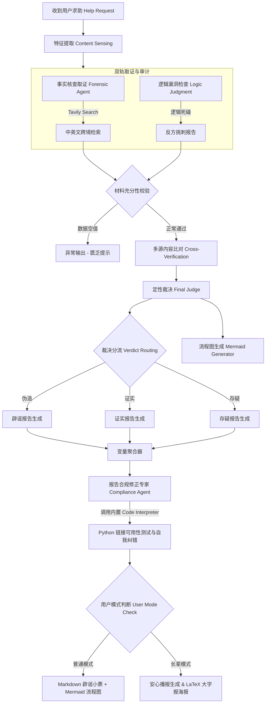

# 🛡️ 谣言终结者：基于多源异构对抗博弈的多模态事实核查系统 (VeriFlow-AntiRumor)

[](https://nodejs.org/)
[](https://react.dev/)
[](https://dify.ai/)
[](https://www.unihiker.com/)
[](#)

面向 AI 时代多源虚假信息的智能事实核查与适老化辟谣系统。本项目专为**第九届全国青少年人工智能创新挑战赛 - “AI智能体设计开发专项赛”**决赛路演及成果交付研发。

---

## 🚀 项目简介 (Overview)

在 AIGC（生成式人工智能）浪潮下，虚假信息以前所未有的速度肆虐，传统搜索引擎和通用大模型常常因为“静态知识库”与“事实幻觉”给出编造的虚假回答（如伪造科研数据、虚构新闻网址等），成为谣言的二次催化剂。同时，“数字银发族”（老年群体）由于视力退化、不习惯复杂的手机交互，极易成为网络伪科学、恐吓式营销谣言的受害者。

**《谣言终结者 (VeriFlow-AntiRumor)》** 致力于通过**级联工作流约束**、**多智能体对抗博弈**与**深度适老化设计**，重新构建人机协同的数字信任边界。系统提供具有强科技感、白盒化推理的 Web 端，以及一键录音求助的 DFRobot 行空板 (Unihiker) 物理智能硬件终端，为长辈家庭筑起一道坚实的信息安全防线。

---

## ✨ 核心特性 (Key Features)

| 维度 | 🖥️ 普通模式 (科技白盒版) | 👵 长辈模式 (温暖大字版) |
| :--- | :--- | :--- |
| **设计初心** | 为大众和青少年提供严密、透明、科学的事实求证窗口。 | 突破视力与交互鸿沟，为数字银发族提供无门槛的温情界面。 |
| **界面视觉** | 极简沙漠感配色，流式展现 AI 探员的“思维风暴”日志。 | 暖黄底色（大字版）、超大按钮、粗边框、高对比度。 |
| **等待体验** | **白盒日志流**：流式全量输出 Tavily 检索与红蓝博弈细节。 | **绿色进度条**：隐去复杂日志以防焦虑，伴随打字印刷声反馈。 |
| **结论载体** | **Markdown 辟谣小票** + Mermaid 交互式逻辑推导图。 | **拟物化辟谣小票**（带盖章动效）+ **LaTeX 三段式养生大字报** + **温情儿女声 TTS 播报**。 |
| **分享阻断** | 复制报告文本，适合网页端严肃求证。 | **一键微信朋友圈长图卡片**（支持截屏保存分享）。 |

---

## 🤖 23节点红蓝对抗博弈工作流 (Workflow Architecture)

为了保障结论的严谨度与真实性，本系统在 Dify 平台构建了多达 **23 个节点** 的级联核查工作流。核心处理管线包含以下五个关键阶段：



1. **多模态特征提取 (Content Sensing)**：提取用户上传的文字、语音、聊天截图（OCR）等物理特征，遵循“只描述不臆造”的合规红线。
2. **正反双轨博弈取证**：
   - **正方 (Forensic Agent)**：降噪并提炼实体词，调用 Tavily 执行实时检索。具备中英文跨境决策，自动翻译为英文并配以 `hoax` / `debunk` 后缀获取全球权威科学文献。
   - **反方 (Logic Judgment)**：专注于因果倒置、情绪煽动恐吓词（如“赶紧全家删”、“致癌元凶”）和剂量缺失等逻辑漏洞。
3. **真相法庭裁决 (Final Judge)**：对红蓝对比矩阵进行多源交叉比对，判定传言为“证实”、“伪造”或“存疑”，并输出 150 字内的中立裁决理由。
4. **Mermaid 拓扑推理图生成**：根据裁决结果，动态生成 graph TD 源码，证实输出“收敛结构”，伪造输出“错位结构”，存疑输出“分支结构”。
5. **Python 代码沙箱链接自愈 (Compliance Agent)**：自动编写并发连通性测试脚本，送入 Dify 的内置 Python 沙箱执行。对于失效/404网址执行闭环自我修正，抹除失效引用，彻底解决大模型的死链幻觉。

---

## 🛠️ 硬核技术攻关 (Technical Breakthroughs)

### 1. Canvas CORS 图片代理 (防画布污染)
- **难点**：生成的辟谣小票包含网络配图时，使用 `html2canvas` 截图会因为跨域请求污染画布，导致浏览器拒绝执行 `toDataURL`，用户无法保存长图。
- **方案**：在 Express 后端架设同源代理服务 `/api/proxy-image?url=...`。前端将所有图片地址重定向至代理接口，使浏览器视其为同源请求，秒级生成分享卡片。

### 2. Mermaid 图表 d3-zoom 手势交互画布
- **难点**：在长辈模式大字号（1.5倍）下，Mermaid 的 SVG 内部文字极易发生节点堆叠和溢出遮挡。
- **方案**：构建响应式组件，动态注入 CSS 改变 SVG 内部字体并扩宽字符间距；集成 `d3-zoom` 交互机制，监听鼠标/双指捏合事件动态计算 Matrix 转换，使用户可以通过自由放大与拖拽来查看完整的逻辑链。

### 3. 行空板 Tkinter 非 BMP 字符 (Emoji) 安全过滤器
- **难点**：行空板板载 Linux 界面在绘制大模型输出的 Emoji（如 🌟、❌，Unicode 编码大于 `0xffff`）时，底层 Tkinter 会抛出致命的 `TclError` 并发生程序闪退。
- **方案**：在 Python 硬件端设计了安全防崩溃装饰器，通过正则自动洗涤非 BMP 字符，保障了物理终端 100% 坚韧运行。

### 4. 行空板“远程 Web 虚拟扬声器”代理中转
- **难点**：行空板由于体积所限，未配高功率扬声器，长辈录音查证后无法听清安心报告的声音播报。
- **方案**：硬件端按键录音发送至后端，大模型生成安心播报词并由 `edge-tts` 本地合成音频。Express 后端向已建立连接的 React 网页端推送广播，借由高品质电脑扬声器进行大声播报，跨越微型硬件音频输出短板。

---

## 📁 项目目录结构 (Folder Structure)

```text
├── 提交文件/               # 比赛官方提交材料
│   ├── 高中组-浙江省-温州市-温州中学-潘烁宇、尹晟言-《谣言终结者智能体》基本信息表.docx
│   ├── 高中组-浙江省-温州市-温州中学-潘烁宇、尹晟言-《谣言终结者智能体》项目介绍.md
│   ├── 高中组-浙江省-温州市-温州中学-潘烁宇、尹晟言-《谣言终结者智能体》PPT介绍.pptx
│   ├── 承诺书.pdf           # 参赛承诺书 PDF
│   ├── PROJECT_PROCESS.pdf   # 项目开发纪实 PDF 备份
│   ├── BACKEND_PROMPTS.md   # Dify 工作流提示词完整汇总
│   └── 过程性材料/           # 包含原型设想、红蓝对抗架构、开发记录截图
├── docs/                   # 项目深度文档与自查报告
│   ├── AI智能体设计开发专项赛_评分指标对照自查报告.md  # 对照评分指标的逐分点分析
│   ├── development_report.md  # 详细的项目开发与技术实践报告（拓扑图、接口解析）
│   ├── DESIGN.md           # 界面交互与适老化规范
│   ├── PRODUCT.md          # 需求定义与核心价值文档
│   └── 谣言终结者_汇报视频脚本.md # 高保真路演视频配音与交互脚本
├── dify_workflows/         # Dify 智能体工作流配置文件
│   ├── 谣言终结者：基于多源异构对抗博弈的多模态事实核查系统 - Dify.html # 工作流静态看板
│   └── 谣言终结者：基于多源异构对抗博弈的多模态事实核查系统 (12).yml # 23节点工作流配置文件
├── scripts/                # 辅助开发、文本解析与数据抽取 Python 脚本
├── assets/                 # 静态资源（包括打字声、印章声等 MP3）
├── src/                    # React 19 前端源码
│   ├── components/         # React UI 组件
│   │   ├── MermaidChart.tsx   # Mermaid 流程图手势交互组件
│   │   ├── ResultTicket.tsx   # 辟谣小票与朋友圈卡片截图组件
│   │   ├── ThinkingWorkflow.tsx # SSE 流式思维风暴日志组件
│   │   ├── AudioRecorderModal.tsx # 适老化麦克风录音模态框
│   │   └── GlassIcons.tsx     # 适老化超大玻璃感功能按钮
│   ├── App.tsx             # 核心业务逻辑与状态分发
│   ├── index.css           # 全局 CSS 样式系统 (Vite-Tailwind4 适配)
│   └── main.tsx            # 应用挂载入口
├── server/
│   └── index.ts            # Node.js + Express 后端服务 (CORS代理、SSE转发、TTS本地生成)
├── unihiker_app.py         # 行空板物理程序（支持无硬件自适应 PC 高保真模拟器）
├── config.json             # 硬件/API 配置文件 (Dify API Key 配置处)
├── config.example.json     # 配置文件配置模板
├── .gitignore              # Git 忽略文件（包含自动过滤 config.json 及临时文件规则）
├── package.json            # 依赖与打包指令
└── README.md               # 项目快速启动与演示文档 (本文档)
```

---

## ⚙️ 本地快速运行与配置 (Local Setup & Run)

### 1. 运行环境要求
- **Node.js** (v18.0.0 或更高版本)
- **Python 3** (用于运行 PC 高保真模拟器，支持 Python 3.8 ~ 3.11)
- 安装 TTS 运行环境：`pip install requests edge-tts flask` (如需要使用本地 TTS 语音生成，请确保系统已安装并配置 `edge-tts`)

### 2. 依赖安装
在项目根目录下，执行以下命令安装前后端依赖：
```bash
npm install
```

### 3. 配置 Dify API Key
1. 将根目录下的 `config.example.json` 复制一份并重命名为 `config.json`：
```json
{
  "dify_api_key": "您的 Dify Workflow API Key",
  "dify_base_url": "https://api.dify.ai/v1",
  "max_record_seconds": 30,
  "tts_voice": "zh-CN-XiaoxiaoNeural"
}
```
2. 填入您的 Dify 工作流 API Key（项目内已由 `.gitignore` 自动隔离，防止 API 密钥泄露至 GitHub 仓库）。

### 4. 启动开发服务器
使用以下命令将**同时启动** Express 后端接口（端口 3001）和 Vite 前端服务（端口 3000）：
```bash
npm run dev
```
启动成功后，在浏览器中打开 `http://localhost:3000` 即可访问网页端。

---

## 📟 行空板物理终端与模拟器运行 (Unihiker App)

### 1. 普通电脑上运行高保真模拟器 (PC Simulation)
如果您的电脑上没有连接行空板硬件，直接在终端中运行 `unihiker_app.py`。程序检测到无物理硬件库时，会自动启动基于 **Tkinter** 开发的 **240x320 物理规格高保真模拟器**：
```bash
python unihiker_app.py
```
*   **按键 A (录音求助)**：在模拟器界面上点击“A键”或按下键盘上的 **A** 键。
*   **按键 B (切换配色模式)**：在模拟器界面上点击“B键”或按下键盘上的 **B** 键，可无缝切换普通模式和长辈版高对比度蓝黄配色模式。
*   模拟器会自动加载 `config.json` 的 API 参数并连接本地运行的 Node.js 后端。

### 2. 在行空板上部署
1. 将行空板通过 USB 线连接至电脑，通过 SCP 或行空板网页文件管理器将 `unihiker_app.py` 和 `config.json` 拷贝到板子上的 `/root/` 目录下。
2. 确保板子已成功连接 Wi-Fi，且能够访问外网。
3. 在板子上运行以下命令启动程序：
   ```bash
   python unihiker_app.py
   ```
   程序会自动检查并静默安装缺失的 `requests`、`edge-tts` 等依赖包。

---

## 🎓 比赛路演快捷演示 (Ctrl+Alt+T 免 Token 演示模式)

为了让评委老师在**无网络**或**无大模型 Token 消耗**的情况下快速体验本系统所有的交互细节（尤其是长辈模式、打字机打字特效、盖章物理反馈、小票截屏分享），我们在前端中预留了与真实 Dify 接口调用流程**完全一致**的**“快速路演通道”**：

1. 打开网页 `http://localhost:3000`。
2. 保持键盘处于英文状态，同时按下 **`Ctrl + Alt + T`** 组合键。
3. 系统将立即开启模拟 Dify 后台工作流状态，展现“思维风暴”的流式日志直播。整个流程包含**特征提取、事实取证、逻辑审计、定性裁决、死链自愈、安心重构等完整的 8 个核心模拟步骤**（每步带有随机的自然加载延迟，总耗时约 8~10 秒，与真实 API 返回速度高度一致），并在长辈模式下同步触发 8 秒安心温情倒计时与 100% 适老化进度条。
4. 倒计时结束后，将自动弹出高保真测试分析小票。
5. 在该票据界面，您可以畅快展示一键切换长辈大字报、手势缩放拖拽 Mermaid 逻辑图、以及点击“生成分享卡片”并进行截屏保存的全部功能！

---

## 📚 项目关键交付文档索引 (Documentation Index)

如果您需要深入研究本项目的工程实现和比赛评分对照，请点击以下链接阅读：

- **自查报告**：[评分指标对照自查报告.md](./docs/AI智能体设计开发专项赛_评分指标对照自查报告.md) —— *严格对照官方手册，梳理所有高分得分点。*
- **开发报告**：[项目开发与技术实践报告.md](./docs/development_report.md) —— *深度解析 23 节点工作流、CORS 污染、SSE、Mermaid交互等方案。*
- **视频脚本**：[汇报视频配音与交互脚本.md](./docs/谣言终结者_汇报视频脚本.md) —— *层层递进的高保真路演视频配音文案与音效设计。*
- **开发纪实**：[项目开发纪实与技术困难解决方案.md](./PROJECT_PROCESS.md) —— *记录本项目从 0 到 1 的开发过程与采坑解决方案。*
