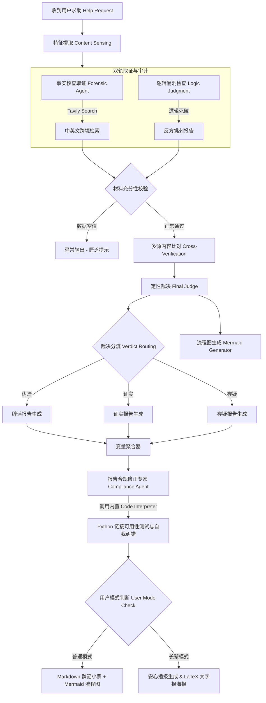

# 🛡️ 谣言终结者：基于多源异构对抗博弈的多模态事实核查系统 (VeriFlow-AntiRumor)

[](https://nodejs.org/)
[](https://react.dev/)
[](https://dify.ai/)
[](https://supabase.com/)
[](https://www.unihiker.com/)
[](#)

面向 AI 时代多源虚假信息的智能事实核查与适老化辟谣系统。本项目专为**第九届全国青少年人工智能创新挑战赛 - “AI智能体设计开发专项赛”**决赛路演及成果交付研发。

---

## 🚀 项目简介 (Overview)

在 AIGC（生成式人工智能）浪潮下，虚假信息以前所未有的速度肆虐，传统搜索引擎和通用大模型常常因为“静态知识库”与“事实幻觉”给出编造的虚假回答（如伪造科研数据、虚构新闻网址等），成为谣言的二次催化剂。同时，“数字银发族”（老年群体）由于视力退化、不习惯复杂的手机交互，极易成为网络伪科学、恐吓式营销谣言的受害者。

**《谣言终结者 (VeriFlow-AntiRumor)》** 致力于通过**级联工作流约束**、**多智能体对抗博弈**、**深度适老化多模态**与**云端高可靠数据隔离**，重新构建人机协同的数字信任边界。系统提供具有强科技感、白盒化推理的 Web 端，以及一键录音求助的 DFRobot 行空板 (Unihiker) 物理智能硬件终端，为长辈家庭筑起一道坚实的信息安全防线。

---

## ✨ 核心特性 (Key Features)

| 维度 | 🖥️ 普通模式 (科技白盒版) | 👵 长辈模式 (温暖大字版) |
| :--- | :--- | :--- |
| **设计初心** | 为大众和青少年提供严密、透明、科学的事实求证窗口。 | 突破视力与交互鸿沟，为数字银发族提供无门槛的温情界面。 |
| **界面视觉** | 极简沙漠感配色，流式展现 AI 探员的“思维风暴”日志。 | 暖黄底色（大字版）、超大按钮、粗边框、高对比度。 |
| **等待体验** | **白盒日志流**：流式全量输出 Tavily 检索与红蓝博弈细节。 | **绿色进度条**：隐去复杂日志以防焦虑，伴随打字印刷声反馈。 |
| **结论载体** | **Markdown 辟谣小票** + Mermaid 交互式逻辑推导图。 | **拟物化辟谣小票**（带盖章动效）+ **自适应 LaTeX 养生大字报** + **温情儿女声 TTS 播报**。 |
| **分享阻断** | 复制报告文本，适合网页端严肃求证。 | **一键微信朋友圈长图卡片** + **高清大字报海报导出与复制**。 |
| **历史隔离** | 云端私有历史快照，长辈/普通模式指纹隔离，点击秒开。 | 独立长辈模式历史库，跳过二次生成，还原历史快照。 |
| **账号与算力** | 游客免密即用 + 账号密码无缝迁移 + 每日签到领额度。 | 智能 IP 防刷与阶梯充值中心，保障算力生态自给自足。 |

---

## 🤖 23节点红蓝对抗博弈工作流 (Workflow Architecture)

为了保障结论的严谨度与真实性，本系统在 Dify 平台构建了多达 **23 个节点** 的级联核查工作流。核心处理管线包含以下五个关键阶段：


```mermaid
graph TD
    In[收到用户求助 Help Request] --> Sensing[特征提取 Content Sensing]
    Sensing --> Parallel[双轨取证与审计]
    
    subgraph Parallel [双轨取证与审计]
        Forensic[事实核查取证 Forensic Agent] -->|Tavily Search| WebSearch[中英文跨境检索]
        Logic[逻辑漏洞检查 Logic Judgment] -->|逻辑死磕| RedReport[反方挑刺报告]
    end
    
    WebSearch & RedReport --> Suff{材料充分性校验}
    Suff -->|数据空值| ErrOut[异常输出 - 匮乏提示]
    Suff -->|正常通过| Matrix[多源内容比对 Cross-Verification]
    
    Matrix --> Judge[定性裁决 Final Judge]
    
    Judge --> Route{裁决分流 Verdict Routing}
    Route -->|伪造| Rumor[辟谣报告生成]
    Route -->|证实| Proved[证实报告生成]
    Route -->|存疑| Doubt[存疑报告生成]
    
    Judge --> MermaidGen[流程图生成 Mermaid Generator]
    
    Rumor & Proved & Doubt --> VarAgg[变量聚合器] --> Compliance[报告合规修正专家 Compliance Agent]
    
    Compliance -->|调用内置 Code Interpreter| PythonRun[Python 链接可用性测试与自我纠错]
    
    PythonRun --> ModeCheck{用户模式判断 User Mode Check}
    ModeCheck -->|普通模式| NormalOut[Markdown 辟谣小票 + Mermaid 流程图]
    ModeCheck -->|长辈模式| ElderGen[安心播报生成 & LaTeX 大字报海报]
```

1. **多模态特征提取 (Content Sensing)**：提取用户上传的文字、语音、聊天截图（OCR）等物理特征，遵循“只描述不臆造”的合规红线。
2. **正反双轨博弈取证**：
   - **正方 (Forensic Agent)**：降噪并提炼实体词，调用 Tavily 执行实时检索。具备中英文跨境决策，自动翻译为英文并配以 `hoax` / `debunk` 后缀获取全球权威科学文献。
   - **反方 (Logic Judgment)**：专注于因果倒置、情绪煽动恐吓词（如“赶紧全家删”、“致癌元凶”）和剂量缺失等逻辑漏洞。
3. **真相法庭裁决 (Final Judge)**：对红蓝对比矩阵进行多源交叉比对，判定传言为“证实”、“伪造”或“存疑”，并输出 150 字内的中立裁决理由。
4. **Mermaid 拓扑推理图生成**：根据裁决结果，动态生成 graph TD 源码，证实输出“收敛结构”，伪造输出“错位结构”，存疑输出“分支结构”。
5. **Python 代码沙箱链接自愈 (Compliance Agent)**：自动编写并发连通性测试脚本，送入 Dify 的内置 Python 沙箱执行。对于失效/404网址执行闭环自我修正，抹除失效引用，彻底解决大模型的死链幻觉。

---

## 🛠️ 硬核技术攻关 (Technical Breakthroughs)

### 1. 云端私有快照与全网缓存双轨解耦 (Supabase Architecture)
- **难点**：多用户重复核查同一谣言时，既要利用缓存降本，又不能让用户 B 生成的新报告粗暴覆盖用户 A 的历史记录；且需防止长辈模式与普通模式的回答相互串扰。
- **方案**：构建了独立缓存表 `rumor_cache` 与用户私有快照表 `user_history`。公共缓存用于高并发毫秒级命中并注入 `isElderlyMode` 哈希因子；用户历史记录存储独立数据快照，点击历史记录直接还原用户当时的报告视图，实现 100% 数据隔离。

### 2. 原生 KaTeX 响应式大字报排版与高清无损导出
- **难点**：长辈大字报公式在不同屏幕或高 DPI 缩放时容易溢出红框被截断，且使用 CSS 视觉缩放会导致导出图片尺寸不匹配。
- **方案**：自研视口响应式字号计算引擎，通过 `ResizeObserver` 动态计算可用宽高，直接调节原生 `font-size`，使大字报在各种尺寸下始终 100% 严丝合缝包裹在传统告示红框内，导出图片晶莹剔透、完整无瑕。

### 3. Mermaid 智能体脑图异常静默熔断
- **难点**：大模型生成复杂脑图时偶尔产生语法符号嵌套错误，在界面上渲染出难看的红色 Syntax error 报错块。
- **方案**：在 iframe 容器内构建语法预检验沙箱（`mermaid.parse`）并捕获全局异常，一旦检测到语法异常立即静默隐藏整个图表容器，保证用户端视觉体验优雅无噪点。

### 4. 智能 IP 频控与访客/账号平滑迁移
- **难点**：开放式 AI 应用极易受到恶意脚本高频刷取算力；同时用户在免密游客状态下的历史记录在注册登录后容易丢失。
- **方案**：在 Express 网关实现 IP 级初始额度频控（单 IP 限制 5 个初始免费访客）；同时提供一键迁移接口，在用户注册/登录成功的瞬间，将本地 IndexedDB / Supabase 中的访客历史记录与剩余积分原子化合流至正式账户中。

### 5. 行空板“远程 Web 虚拟扬声器”代理中转与非 BMP 字符清洗
- **难点**：行空板硬件扬声器音量小、Tkinter 绘制 Emoji 表情容易闪退。
- **方案**：设计了 Unicode 字符清洗过滤器；并借助 SSE 广播机制，让长辈按下硬件按键后，由家里联网的大电视/电脑音箱高保真播报安心语音，完美化解微型硬件短板。

---

## 📁 项目目录结构 (Folder Structure)

```text
├── dify_workflows/         # Dify 智能体工作流配置文件
│   ├── 谣言终结者：基于多源异构对抗博弈的多模态事实核查系统 - Dify.html # 工作流静态看板
│   └── 谣言终结者：基于多源异构对抗博弈的多模态事实核查系统 (12).yml # 23节点工作流配置文件
├── docs/                   # 比赛全套交付文档、自查报告与答辩指南
│   ├── 谣言终结者_5分钟决赛答辩汇报与评委问答指南.md # 决赛5分钟路演+2分钟问答指南
│   ├── 谣言终结者_3分钟答辩汇报与评委问答指南.md # 3分钟路演指南
│   ├── AI智能体设计开发专项赛_评分指标对照自查报告.md # 官方指标对照自查表
│   └── development_report.md # 深度开发与技术报告
├── scripts/                # 辅助开发、文本解析与数据抽取 Python 脚本
├── src/                    # React 19 前端源码
│   ├── components/         # UI 核心组件
│   │   ├── MermaidChart.tsx   # Mermaid 流程图手势交互与异常熔断组件
│   │   ├── ResultTicket.tsx   # 辟谣小票、LaTeX大字报与图片导出组件
│   │   ├── ThinkingWorkflow.tsx # SSE 流式思维风暴日志组件
│   │   ├── AudioRecorderModal.tsx # 适老化麦克风录音模态框
│   │   ├── LoginModal.tsx     # 用户注册/登录与数据平滑迁移弹窗
│   │   └── RechargeModal.tsx  # 额度充值中心与每日签到组件
│   ├── App.tsx             # 核心业务逻辑、模式切换与状态分发
│   ├── supabaseClient.ts   # Supabase 云端数据库客户端
│   ├── index.css           # 全局 CSS 样式系统 (Vite-Tailwind4 适配)
│   └── main.tsx            # 应用挂载入口
├── server/
│   ├── index.ts            # Node.js + Express 后端服务 (鉴权、缓存、代理、SSE)
│   └── schema.sql          # Supabase PostgreSQL 完整数据表结构定义
├── unihiker_app.py         # 行空板物理程序（支持无硬件自适应 PC 高保真模拟器）
├── Dockerfile              # 远程云服务器 Docker 镜像编译配置文件
├── PROJECT_PROCESS.md      # 项目过程性文件与开发纪实 (本仓库主线文档)
├── package.json            # 依赖与打包指令
└── README.md               # 项目快速启动与演示文档 (本文档)
```

---

## ⚙️ 本地快速运行与配置 (Local Setup & Run)

### 1. 运行环境要求
- **Node.js** (v18.0.0 或更高版本)
- **Python 3** (用于运行 PC 高保真模拟器，支持 Python 3.8 ~ 3.11)
- 安装 TTS 运行环境：`pip install requests edge-tts flask` (如需要使用本地 TTS 语音生成，请确保系统已安装并配置 `edge-tts`)

### 2. 依赖安装
在项目根目录下，执行以下命令安装前后端依赖：
```bash
npm install
```

### 3. 配置环境变量 / Dify API Key
1. 将根目录下的 `config.example.json` 复制一份并重命名为 `config.json`：
```json
{
  "dify_api_key": "您的 Dify Workflow API Key",
  "dify_base_url": "https://api.dify.ai/v1",
  "max_record_seconds": 30,
  "tts_voice": "zh-CN-XiaoxiaoNeural"
}
```
2. 填入您的 Dify 工作流 API Key（项目内已由 `.gitignore` 自动隔离，防止 API 密钥泄露至 GitHub 仓库）。

### 4. 启动开发服务器
使用以下命令将**同时启动** Express 后端接口（端口 3001）和 Vite 前端服务（端口 3000）：
```bash
npm run dev
```
启动成功后，在浏览器中打开 `http://localhost:3000` 即可访问网页端。

---

## 📟 行空板物理终端与模拟器运行 (Unihiker App)

### 1. 普通电脑上运行高保真模拟器 (PC Simulation)
如果您的电脑上没有连接行空板硬件，直接在终端中运行 `unihiker_app.py`。程序检测到无物理硬件库时，会自动启动基于 **Tkinter** 开发的 **240x320 物理规格高保真模拟器**：
```bash
python unihiker_app.py
```
*   **按键 A (录音求助)**：在模拟器界面上点击“A键”或按下键盘上的 **A** 键。
*   **按键 B (切换配色模式)**：在模拟器界面上点击“B键”或按下键盘上的 **B** 键，可无缝切换普通模式和长辈版高对比度蓝黄配色模式。

### 2. 在行空板硬件上部署
1. 将行空板通过 USB 线连接至电脑，将 `unihiker_app.py` 和 `config.json` 拷贝到板子上的 `/root/` 目录下。
2. 确保板子已成功连接 Wi-Fi，且能够访问外网。
3. 在板子上运行以下命令启动程序：
   ```bash
   python unihiker_app.py
   ```
   程序会自动检查并静默安装缺失的 `requests`、`edge-tts` 等依赖包。

---

## 🎓 比赛路演快捷演示 (Ctrl+Alt+T 免 Token 演示模式)

为了让评委老师在**无网络**或**无大模型 Token 消耗**的情况下快速体验本系统所有的交互细节（尤其是长辈模式、打字机打字特效、盖章物理反馈、小票截屏分享），我们在前端中预留了与真实 Dify 接口调用流程**完全一致**的**“快速路演通道”**：

1. 打开网页 `http://localhost:3000`。
2. 保持键盘处于英文状态，同时按下 **`Ctrl + Alt + T`** 组合键。
3. 系统将立即开启模拟 Dify 后台工作流状态，展现“思维风暴”的流式日志直播。整个流程包含**特征提取、事实取证、逻辑审计、定性裁决、死链自愈、安心重构等完整的 8 个核心模拟步骤**，并在长辈模式下同步触发 8 秒安心温情倒计时与 100% 适老化进度条。
4. 倒计时结束后，将自动弹出高保真测试分析小票，全面演示大字报、脑图手势缩放与长图导出分享功能！

---

## 📚 比赛关键交付文档索引 (Documentation Index)

如果您需要深入研究本项目的工程实现和比赛评分对照，请点击以下链接阅读：

- 🏆 **决赛答辩指南**：[谣言终结者_5分钟决赛答辩汇报与评委问答指南.md](./docs/谣言终结者_5分钟决赛答辩汇报与评委问答指南.md) —— *5分钟路演答辩文稿 + 2分钟高维评委问答策略库。*
- 📋 **评分对照自查**：[AI智能体设计开发专项赛_评分指标对照自查报告.md](./docs/AI智能体设计开发专项赛_评分指标对照自查报告.md) —— *严格对照官方手册，梳理全部高分得分点。*
- 📖 **技术实践报告**：[项目开发与技术实践报告.md](./docs/development_report.md) —— *深度解析 23 节点工作流、CORS 污染、SSE、Mermaid交互等方案。*
- 🎬 **汇报视频脚本**：[汇报视频配音与交互脚本.md](./docs/谣言终结者_汇报视频脚本.md) —— *层层递进的高保真路演视频配音文案与音效设计。*
- 📝 **全流程开发纪实**：[项目开发纪实与技术困难解决方案.md](./PROJECT_PROCESS.md) —— *记录本项目从 0 到 1 的开发过程与采坑解决方案。*
