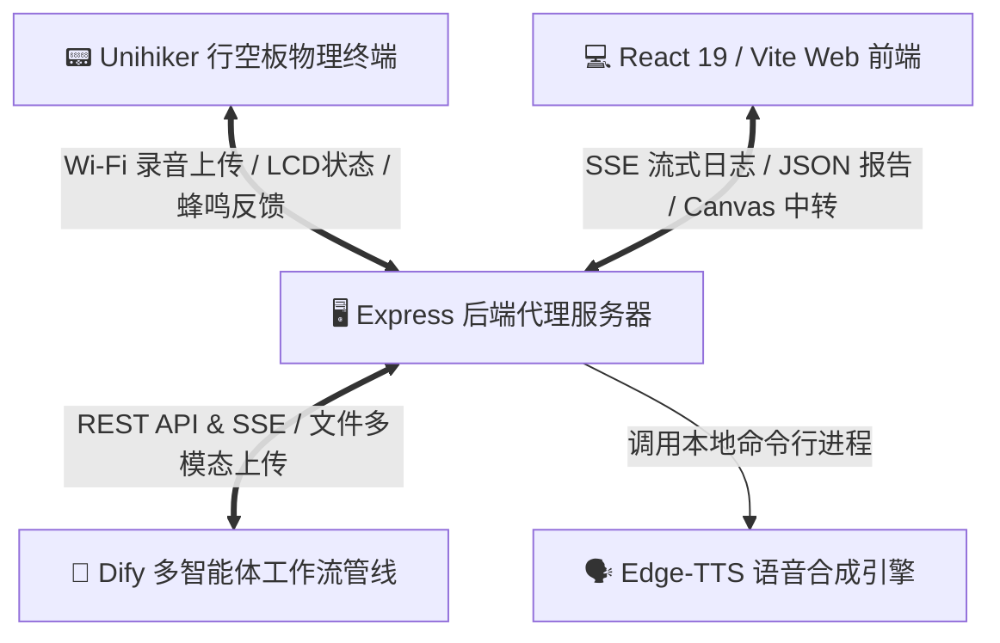
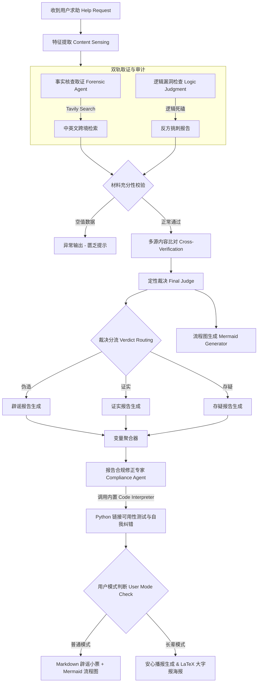

# 《谣言终结者 (VeriFlow-AntiRumor)》项目开发与技术实践报告

本项目专为**第九届全国青少年人工智能创新挑战赛 - AI智能体设计开发专项赛**决赛研发。项目突破了传统生成式 AI 在事实核查中频发的“事实幻觉”与“死链引用”瓶颈，面向“数字银发族”的人机交互鸿沟，打造了一套**软硬一体、多端协同的可视化多模态事实核查智能体平台**。

---

## 1. 项目立项背景与痛点定义

### 1.1 AIGC 时代的虚假信息海啸
随着生成式 AI（AIGC）技术的爆发，虚假图文、深度伪造（Deepfake）视频、AI 克隆语音的制造门槛与分发成本降至为零。更具隐蔽性的是，当大众向通用大模型（如 ChatGPT、Claude）求证流言时，由于大模型知识库静态限制及概率学预测机制，常常产生**“事实幻觉”**（如编造虚假新闻网站、虚构法条、伪造科研数据 URL），反而成为谣言的二次催化剂。

### 1.2 “数字银发族”的特有困境
在信息浪潮中，视力退化、认知门槛高、对伪科学或夸大宣传（如夸张的健康养生秘方、金融套路贷）缺乏警惕的**老年群体**，成为受网络流言侵害最深的弱势群体。主流核查平台存在以下人机交互痛点：
* **信息录入繁琐**：需要打字、复制文本或截图上传，长辈操作极其不便。
* **反馈晦涩黑箱**：直接呈现大段专业术语，查证过程完全黑盒，老人难以建立权威信任。
* **等待焦虑严重**：15 至 30 秒的后台多源取证周期，面对空白加载界面老人极易认为系统死机而退出。
* **阻断二次传播能力弱**：查证结论无法以直观、符合传统阅读直觉的形式裂变，无法在老年人最活跃的“相亲相爱一家人”微信家族群中实施阻断。

---

## 2. 协同系统拓扑架构设计

系统设计为**“四端协同、软硬联动”**的拓扑结构，确保各端共享同一套多智能体决策大脑，并根据端特性提供差异化呈现：



* **🤖 Dify 智能体工作流（大脑）**：负责 23 节点级联运算，执行多源异构核查、红蓝对抗、链接可用性自愈测试，根据 `isElderlyMode` 分发对应载体。
* **🖥️ Express 代理服务端（中枢）**：负责跨域图片代理（防画布污染）、文件转码、中转 Dify SSE 长连接、调用本地 TTS 合成。
* **💻 React 19 / Vite Web 端（主线窗口）**：支持“普通极简风格”与“长辈温暖大字风”的无缝切换。
* **📟 Unihiker 行空板物理终端（延伸窗口）**：提供物理按键录音、LCD 拟物图标刷新和远程代理声音播报。

---

## 3. Dify 23节点多智能体管线深度解析

为保障结论的严谨度与真实性，后端构建了多达 **23 个节点** 的级联核查工作流。核心处理管线包含以下五个关键阶段：



### 3.1 核心节点执行机制

#### 1. 特征提取 Content Sensing (LLM Node)
* **工作方式**：开启视觉高清能力，提取输入素材（截图 OCR、音视频字幕、纯文本）中的物理特征。包含一重红线：只描述“看到了什么”，禁止主动判定，并且“没收到多模态文件就只能填‘无’”，防止幻觉。
* **输入**：`Help Request.user_text` 与 `Help Request.upload_files`（图片、音频文件）。
* **输出**：结构化文本（【提取核心正文】、【提及核心主体】、【文本风格特征】、【多模态物理特征检测报告】）。

#### 2. 事实核查取证智能体 Forensic Agent (Agent Node)
* **工作方式**：系统的“正方调查员”。
  1. 降噪提炼出核心实体词，生成 3 组简中关键词检索 Tavily。
  2. **跨境检索决策**：研判是否具备海外流言背景或尖端科技属性，若是则自动翻译为英文术语配以 `hoax` / `debunk` 后缀，进行国际 Tavily 二次跨境检索。
* **输入**：`Content Sensing.text`。
* **输出**：标准 Markdown 证据链（发布主体、发布时间、事实定性、原始 URL、可信度评级）。

#### 3. 逻辑漏洞检查 Logic Judgment (LLM Node)
* **工作方式**：系统的“反方辩友”。不进行任何联网，纯粹从形式逻辑和科学常识角度对输入文本进行“逻辑死磕”与文本拆解，扫描因果倒置、情绪煽动恐吓词（如“赶紧全家删”、“癌症元凶”）、剂量缺失等硬伤。
* **输入**：`Content Sensing.text`。
* **输出**：🔍 逻辑漏洞/修辞圈套列表。

#### 4. 材料充分性校验 Material Sufficiency Verification (If-Else Node)
* **工作方式**：条件判定网关。若 `Forensic Agent.text` 与 `Logic Judgment.text` 中任意一个出现完全空值，意味着信息极度匮乏（如用户输入了无具体意图的无意义字符），则走拦截流，进入 `Exception Output` 节点，向用户反馈匮乏声明。若都有数据，则进入最终裁决。

#### 5. 多源内容比对 Cross-Verification (LLM Node)
* **工作方式**：真相法庭的“预审官”。执行“防污染独立审计原则”，将传言、搜索结果与逻辑报告进行三方交叉比对，识别说法冲突与数据边界局限性（纠偏早期新闻反转、已被废止的法规、过时的初步论断等）。
* **输出**：三层比对矩阵。

#### 6. 定性裁决 Final Judge (LLM Node)
* **工作方式**：真相法庭的“首席大法官”。执行黑白灰判定算法：
  * **证实**：核心实质事实与最新定论高度吻合（论证不严密、带情绪词等叙事瑕疵予以豁免）。
  * **伪造**：凭空捏造、依赖历史已被澄清的过时乌龙、或恶意割裂关键剂量/时间边界条件、或违背物理常识。
  * **存疑**：主观观点表达、科学界尚无公认共识的议题。
* **输出**：首行为定性标签（`证实`/`伪造`/`存疑`），第二行为 150 字以内的理由。

#### 7. 流程图生成 Mermaid Generator (LLM Node)
* **工作方式**：根据大法官定性，动态生成 graph TD 思维导图源码。
  * 证实：流向汇聚结构（加粗实线指向结论）。
  * 伪造：左右分栏对比错位图（红色虚线 `-.-` 对比伪造点与真实源流）。
  * 存疑：发散多叉悬决结构（核心焦点居中，虚线分支指向带问号的悬空节点）。
* **约束限制**：禁止使用 `()` `[]` `""` 避免 MathJax 编译失败，并在底部使用 `style` 渲染莫兰迪配色方案（绿/红/黄）。

#### 8. 报告合规修正专家 Compliance Agent (Agent Node)
* **工作方式**：质量合规把关人。大模型引证时频发“死链幻觉”（生成不可达链接破坏权威度）。本组件自动编写一段并发测试 URL 连通性的 Python 脚本送往 Dify 内置 `Code Interpreter` 沙箱中执行。对于超时、404 的链接在 Python 文本中替换为 `[已过滤失效链接]`。大模型检测到该标识后启动**“闭环自我纠错机制”**，无痕重写，自然抹除失效链接痕迹。
* **输入**：由变量聚合器 (`Variable Aggregator`) 汇总的初版事实核查报告。
* **输出**：合规修正后 100% 真实、无死链的完美 Markdown 报告。

#### 9. 用户模式分发与适老生成
* **工作方式**：检测 `isElderlyMode`。若为 `true`，则并行调用：
  * **Elderly Report Generation**：将最终报告重写为唠家常、通俗打比方的“有声安心广播稿”（分为开篇定心丸、聊天式科普和贴心老友叮嘱顺口溜）。
  * **LaTeX Poster Generation**：将文本转化为字号粗大（`\Huge`）、无实线边框、使用 `\hdashline` 分隔、大红文件红头标题的开放 LaTeX `\begin{array}{c}` 海报源码。

---

## 4. 关键技术难点与硬核解决方案

### 4.1 CORS 跨域污染 canvas 与辟谣小票一键保存
* **难点**：普通模式与长辈模式皆支持将生成的辟谣小票（带有网络插图或 Dify 异步生成的图片）一键保存为朋友圈长图卡片。当使用 `html2canvas` 渲染 DOM 树时，只要包含非同源的网络图片，浏览器会出于 CORS 策略启动安全防护，污染 canvas 画布，导致 `toDataURL` 接口直接报错，用户无法下载。
* **解决方案**：在 Express 中转后端（`server/index.ts`）架设同源图片中转代理：

```typescript
app.get('/api/proxy-image', async (req, res) => {
  const imageUrl = req.query.url as string;
  if (!imageUrl) return res.status(400).send('No URL provided');
  try {
    const fetchRes = await fetch(imageUrl);
    const buffer = await fetchRes.arrayBuffer();
    res.set('Content-Type', fetchRes.headers.get('content-type') || 'image/jpeg');
    res.send(Buffer.from(buffer));
  } catch (e) {
    res.status(500).send('Error proxying image');
  }
});
```
前端解析小票 Markdown 时，使用正则将所有图片的 `src` 重定向为 `/api/proxy-image?url=${encodeURIComponent(originalUrl)}`。浏览器将其视为同源请求，从而解除 canvas 跨域污染警告，秒级生成朋友圈长图卡片。

### 4.2 SSE 实时流式广播与“等待焦虑”消除
* **难点**：多源异构事实核查由于处理链长，整体 API 响应需要 15-30 秒。长辈在面对空白加载页时极易误以为死机直接退出。
* **解决方案**：引入 Server-Sent Events (SSE) 流式传输。
  * **普通模式（极简沙漠风）**：右侧展示与 SSE 强绑定的 `ThinkingWorkflow`（思维风暴）组件，实时打字展开后台节点的日志（包含具体的取证条目、红蓝博弈细节），将黑盒后台完全白盒化，把无聊的等待变成“AI 实况推理直播”，以硬核逻辑赢的信任。
  * **长辈模式（温暖大字风）**：为了防止大段复杂代码与文本日志造成老年人信息过载与二次焦虑，**前端完全隐去详细日志**，替换为一条**高度可见、温暖治愈的绿色图形化进度条**，同时伴随打字机印刷声效（SFX），将无序等待转化为有序进度，极大地安抚了老人的焦虑。

### 4.3 长辈大字版下 Mermaid 流程图的排版堆叠冲突
* **难点**：大模型生成的思维导图在老年人大字号模式（1.5 倍）下，SVG 内部文本会发生节点重叠、文本溢出或显示不全。
* **解决方案**：编写 `MermaidChart.tsx` 响应式图表组件：
  1. **CSS 隔离注入**：通过在渲染时动态注入局部 CSS，改变 SVG 内部字体大小（1.5倍），动态增加 `letter-spacing`。
  2. **d3-zoom 手势事件绑定**：在外层嵌套高精度画布，利用 React 监听鼠标/手指的 `mousedown`、`mousemove` 和 `wheel` 事件，计算出 CSS 平移与缩放 Matrix：`transform: translate(x, y) scale(s)`，实时重映射到 SVG 标签上。让老人可以像放大手机照片一样，“捏合/拖动”来自由放大和移动推导图。

### 4.4 行空板 Tkinter 底层引擎非 BMP 字符（Emoji）闪退
* **难点**：部署在行空板物理 Linux 程序 `unihiker_app.py` 中的板载 GUI 引擎底层对大于 `0xffff` 的非 BMP Unicode 字符（即各类 Emoji，如 🌟、❌ 等）缺乏支持，一旦在大模型返回的安心文本中包含这些字符并进行绘制，会直接抛出致命的 `TclError` 异常导致物理终端程序闪退。
* **解决方案**：编写“非 BMP 字符安全防崩溃过滤装饰器”：

```python
def safe_draw_text(original_draw_text):
    def wrapper(*args, **kwargs):
        # 提取 args 里面的 text 字符串，用正则进行 Unicode 清理
        # 只保留 ord(c) <= 0xffff 的字符，直接扣除 Emoji
        clean_args = []
        for arg in args:
            if isinstance(arg, str):
                clean_arg = "".join(c for c in arg if ord(c) <= 0xffff)
                clean_args.append(clean_arg)
            else:
                clean_args.append(arg)
        return original_draw_text(*clean_args, **kwargs)
    return wrapper
```
通过装饰器拦截物理 GUI 的文本绘制接口，保障了行空板物理程序 100% 坚韧不闪退的超强鲁棒性。

### 4.5 行空板物理终端的“远程虚拟扬声器”代理中转
* **难点**：行空板（Unihiker）受制于极小体积与便携化硬件环境，没有配备合适的板载大功率喇叭，无法直接进行大声的安心报告播报。
* **解决方案**：设计了**“远程 Web 扬声器中转代理机制”**。
  1. 老人在物理终端上按 A 键录音，将音频上传至后端 Express，进而传送至 Dify 执行 23 节点流。
  2. Dify 合成“安心报告”后，Flask 服务生成 Edge-TTS 合成请求，将生成的 `.mp3` 报告向已连接的前端 Web 客户端发起播报广播指令。
  3. 利用已建立连接的电脑 Web 端充当物理硬件的**虚拟扬声器**进行声音放大，完美解决了微型硬件的音频输出限制。

---

## 5. 项目三端开发与功能差异对比

在本项目中，我们不仅在后端通过级联工作流构建了强悍的大脑，更在前端开出了针对极客、长辈与硬件的三朵交互之花：

| 对比维度 | 🖥️ Web端 - 普通模式 (主线演示) | 👵 Web端 - 长辈模式 (特定场景补充) | 📟 硬件端 - 行空板物理终端 (特定长辈补充) |
| :--- | :--- | :--- | :--- |
| **设计初心** | 为普通大众和青少年提供严密、透明、科学、白盒可信的事实求证窗口。 | 突破视力与人机交互鸿沟，为数字银发族提供无门槛的适老辟谣界面。 | 为不习惯用智能手机、或者没有网络的长辈，打造摆在桌头即用的防骗网关。 |
| **界面调性** | 极简、温馨、沙漠温馨风、数据流导向、高可信白盒呈现 | 暖黄底色（大字版）、超大按钮、粗边框、极致对比度 | 物理拟物图标、蜂鸣器物理声光反馈 |
| **查证中等待体验** | **白盒日志流**：流式全量卡片流输出 Tavily 检索过程与红蓝博弈细节，主打“高科技感” | **绿色进度条**：流式复杂日志完全隐去以防信息过载，替换为**绿色图形化进度条**，安抚老人情绪 | **LCD 状态刷新**：硬件屏幕刷新当前运行阶段名，伴随蜂鸣器物理按键嘀声反馈 |
| **输出结论载体** | **Markdown 辟谣报告小票** + Mermaid 逻辑推导图（支持鼠标拖拽与捏合） | **拟物化大字辟谣小票**（带盖章动效）+ **LaTeX 三段式养生大字报** + **温情儿女声双音色 TTS 语音播报** | **语音安心报告**（TTS 减速合成，通过网络由**电脑 Web 前端充当虚拟扬声器**发出）+ LCD 显示 |
| **分享阻断设计** | 复制报告文本，适合网页端严肃求证 | **一键微信朋友圈长图卡片**（内置同源图片代理防 CORS 污染）+ LaTeX 大字海报转发 | 摆放于家庭公共区域，随时通过喇叭阻断家庭谣言 |

---

## 6. 项目开发历程与演进

本项目的开发经历了五个主要阶段，实现了从算法验证到硬件落地、体验调优的闭环：

1. **需求定义与原型设计阶段**：确立以“老年人信息安全”为中心的设计逻辑。规划双模态界面及实体小票视觉载体，确立打字机及盖章声作为心理抚慰机制。
2. **Dify 多智能体协同管线构建与升级**：重构了 23 节点工作流，设计“取证智能体 + 逻辑审计节点”双轨博弈；引入 `Compliance Agent` 及内置 Python 代码解释器，攻克大模型死链幻觉瓶颈。
3. **后端 API 中枢与代理层搭建**：编写 Express 代理服务器，中转 SSE 协议与文件传输；集成 `edge-tts` 并发接口；构建 Canvas 跨域中转服务 `/api/proxy-image`。
4. **前端响应式及 Mermaid 拓扑优化**：采用 React 19 + Vite 构建，编写响应式样式，完成了大字版下 Mermaid 流程图的拖拽缩放与自适应样式注入。
5. **软硬联调与行空板物理嵌入**：编写行空板 Python 程序，实现 Emoji 过滤，编写 Tkinter 高保真 PC 仿真模拟器，打通了“物理硬件录音 -> 后端工作流 -> 网页充当扬声器播报”的物理终端落地最后一公里。

## 7. 总结与社会价值展望

《谣言终结者 (VeriFlow-AntiRumor)》通过 **23 节点智能体博弈管线** 从底层确保了核查内容的真实合规，消除了“幻觉”；又通过 **同源代理截图、手势 Mermaid 画布、暖色进度条、儿女双音色 TTS 和物理按键录音**，彻底推平了技术与银发长辈之间的人机鸿沟。

在 AI 爆发的今天，技术不应当以抛下老年人为代价。我们用软硬一体、严谨又充满温情的设计，成功驯化了冰冷的大模型技术，将清晰、温暖的真相送到了长辈的手中。
