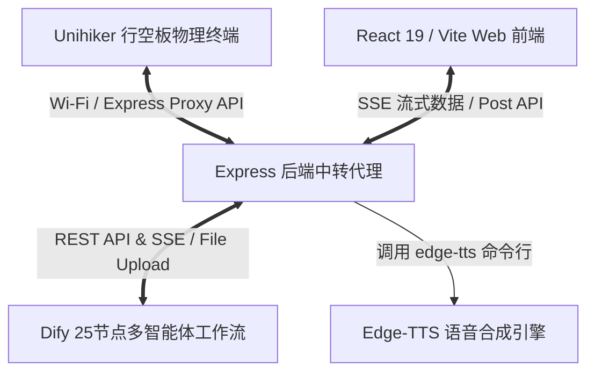
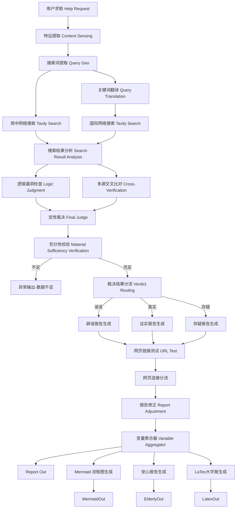
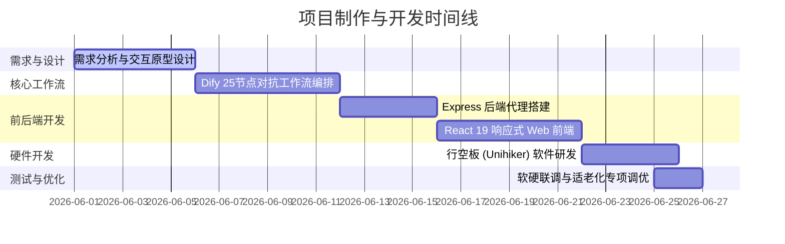

# 谣言终结者：基于多源异构对抗博弈的多模态事实核查系统 (VeriFlow-AntiRumor)
## 项目过程性文件与开发纪实

---

## 1. 项目基本介绍 (Project Introduction)

### 1.1 项目背景与痛点
在生成式 AI (AIGC) 爆发的时代，虚假信息的制造门槛被降为零。一方面，深度伪造 (Deepfake)、AI 生成新闻在社交媒体中大肆传播；另一方面，普通大众在向通用大模型（如 ChatGPT）求证时，往往会遭遇**“事实幻觉”**——大模型因知识库截断产生胡言乱语，反而成为新的谣言次生源。

尤为严峻的是**“数字银发族”**的特有困境：
- **信息识别能力弱**：老年群体对伪科学、夸大宣传的“养生常识”或套路贷等“金融内幕”缺乏警惕。
- **人机交互鸿沟**：主流辟谣平台字体小、操作繁琐、人机交互生硬，长辈难以上手，导致谣言在老年人的微信朋友圈和家族群中呈裂变式传播。

### 1.2 产品定位与系统目标
**《谣言终结者》(VeriFlow-AntiRumor)** 是一套面向银发族深度优化的**可视化多模态事实核查智能体平台**。

- **智能体红蓝博弈**：在系统内部模拟“真相法庭”，通过红蓝智能体对抗辩论，提供白盒化可信推导。
- **极致适老化交互**：一键切换“长辈模式”，提供高对比度、特大字号、行距重组、打字机打字声与盖章声等实体化视听反馈，并能一键生成“微信辟谣小票”和 LaTex 养生大字报，阻断谣言的二次传播。
- **权威事实召回**：通过多语言多路搜索引擎直连，解决模型静态知识库的时效性瓶颈。
- **软硬一体化嵌入**：支持运行于 **DFRobot 行空板 (Unihiker)** 物理智能硬件终端，打造实体化的“家庭安全网卫士”。
- **极简多模态输入**：支持长辈通过一键语音录音、拍张照片、上传视频或直接复制文本发起求助。

---

## 2. 系统架构设计 (System Architecture)

### 2.1 整体拓扑架构
本系统由**四端协同**构成，保证了数据流的实时响应与交互的流畅度：



### 2.2 Dify 25节点工作流逻辑设计
为了保证查证的严谨性，我们在 Dify 平台中设计了 25 个节点的大型工作流。它不依赖单一智能体，而是让多个角色各司其职、高度协同。其核心流转过程如下：



---

## 3. 项目开发与制作过程 (Development Process)

本项目的制作过程遵循严谨的软硬件联合研发流程，共分为五个主要阶段：



1. **第一阶段：需求分析与交互原型设计 (6月1日 - 6月5日)**
   - 确立了以“老年人信息安全”为中心的设计逻辑。
   - 规划了“长辈模式”下的视听双重反馈系统（打字音效模拟印刷，盖章音效确认结论）。
   - 确定以“消费小票”和“大字报”作为适合朋友圈及微信群传播的视觉载体。
2. **第二阶段：Dify 多智能体对抗工作流编排 (6月6日 - 6月11日)**
   - 编排了 25 个工作流节点。设计了“红方智能体”寻找证实证据，“蓝方智能体”寻找逻辑漏洞和反面材料，最后由“裁判长智能体”进行定性裁决的红蓝博弈结构。
   - 集成了 Tavily Search 搜索引擎，利用翻译智能体把关键词译为英文进行跨国多源检索。
3. **第三阶段：Express 中转后端代理搭建 (6月12日 - 6月15日)**
   - 编写 Node.js 中转服务器，将用户上传的多模态文件流分发并上传给 Dify File Upload 接口。
   - 采用 Server-Sent Events (SSE) 协议，将 Dify 推送的节点运行状态实时代理至前端。
   - 集成系统命令行工具 `edge-tts`，为适老化语音合成功能提供高速、拟真的 TTS 接口支持。
4. **第四阶段：React 19 响应式前端开发 (6月16日 - 6月21日)**
   - 采用 Vite 构建工程，UI 引入 GSAP 和 Motion (Framer Motion) 库实现极致顺滑的动态微交互。
   - 实现了双模无缝切换交互：普通模式以科技感、数据流为主；长辈模式以高对比度、超大字体、粗边框、极简按钮为主。
   - 引入 Mermaid.js 渲染可信推导关系图，开发了支持自适应拖拽与滚轮缩放的图表画布。
5. **第五阶段：行空板 (Unihiker) 软件研发与软硬联调 (6月22日 - 6月26日)**
   - 编写 Python 行空板主程序 `unihiker_app.py`。
   - 设计了 PC 图形模拟与真实硬件的自适应环境，支持在 PC 环境下用键盘 A/B 键进行高保真调试。
   - 完成了硬件设备的物理按键录音、数据打包发送、工作流节点实时刷新显示、大字版核查结论播报、蜂鸣器双响反馈的闭环测试。

---

## 4. 项目关键文档与资源清单 (Documents & Resources)

| 文件路径 / 链接 | 文档类型 | 主要功能与分工描述 |
| :--- | :--- | :--- |
| [README.md](file:///d:/Desktop/谣言终结者/README.md) | 说明文档 | 项目的快速启动、安装部署、依赖配置及比赛演示指南。 |
| [unihiker_app.py](file:///d:/Desktop/谣言终结者/unihiker_app.py) | Python 脚本 | 部署于行空板的物理终端控制程序，实现按键录音、屏幕状态渲染、TTS 语音播报及 PC 高保真模拟器。 |
| [package.json](file:///d:/Desktop/谣言终结者/package.json) | 工程配置 | 定义前端 Web 与后端 Node 服务的依赖包及 `npm run dev` 运行命令。 |
| [server/index.ts](file:///d:/Desktop/谣言终结者/server/index.ts) | Node.js 代码 | 核心后端代理，管理跨域图片中转 `/api/proxy-image`、Dify 流式 SSE 转发 `/api/analyze` 和 Edge-TTS 语音合成接口 `/api/tts`。 |
| [src/App.tsx](file:///d:/Desktop/谣言终结者/src/App.tsx) | React 代码 | 客户端核心应用逻辑，控制全局状态（初始化、生成中、分析结果、思维图），实现长辈模式的一键无缝转换。 |
| [src/components/ResultTicket.tsx](file:///d:/Desktop/谣言终结者/src/components/ResultTicket.tsx) | React 组件 | 渲染极具仪式感的“辟谣小票”，包含 LaTeX 大字报、安心报告、一键生成朋友圈辟谣分享卡片及分享截图保存功能。 |
| [src/components/MermaidChart.tsx](file:///d:/Desktop/谣言终结者/src/components/MermaidChart.tsx) | React 组件 | 实现 Dify 产出的推导 Mermaid 流程图的动态自适应渲染、滚轮无限缩放及鼠标拖拽交互。 |
| [src/components/ThinkingWorkflow.tsx](file:///d:/Desktop/谣言终结者/src/components/ThinkingWorkflow.tsx) | React 组件 | 前端流式“思维风暴”加载组件，以手风琴折叠卡片形式同步显示大模型后台 25 个节点的详细日志。 |
| [谣言终结者_比赛汇报PPT.md](file:///d:/Desktop/谣言终结者/谣言终结者_比赛汇报PPT.md) | 演示文稿 | 本项目的第 9 届全国青少年人工智能创新挑战赛路演汇报 PPT 的详细内容及演讲旁白设计。 |

---

## 5. 项目过程中遇到的技术困难与硬核解决方案

### 5.1 截图分享功能受远程图片 CORS 跨域污染 canvas 限制
* **困难描述**：
  长辈模式中有一项核心功能是“一键生成微信辟谣小票/卡片并保存为图片”。然而，大模型在事实核查报告中经常会配有从网络抓取的证据插图或 Dify 异步生成的图片。当使用 `html2canvas` 或 `html-to-image` 将前端 DOM 渲染为图片时，只要 DOM 树中包含非同源的远程图片，浏览器就会出于安全策略启动“画布污染”（Canvas Context Tainted）防护，导致 `toDataURL` 接口报错，使用户无法导出卡片图片。
* **硬核解决方案**：
  在 Express 后端架设了一个专属的同源图片代理服务：
  ```typescript
  app.get('/api/proxy-image', async (req, res) => {
    const imageUrl = req.query.url as string;
    if (!imageUrl) return res.status(400).send('No URL provided');
    try {
      const fetchRes = await fetch(imageUrl);
      const buffer = await fetchRes.arrayBuffer();
      res.set('Content-Type', fetchRes.headers.get('content-type') || 'image/jpeg');
      res.send(Buffer.from(buffer));
    } catch (e) {
      res.status(500).send('Error proxying image');
    }
  });
  ```
  在 React 前端解析 Markdown 卡片时，使用正则表达式匹配所有图片标签，将 `src` 指向同源的 `/api/proxy-image?url=${encodeURIComponent(originalUrl)}`。这样浏览器将其视为同源请求，从而完美解除了 canvas 的跨域污染警报，用户在任何环境下都可以秒级生成清晰的微信朋友圈分享卡片。

### 5.2 25节点大型工作流的高延迟与等待流失率
* **困难描述**：
  多源异构博弈需要经历多路检索、翻译、红蓝对抗、链接测试等 25 个复杂节点，完成一次核查需要 15 - 30 秒。长辈在面对长时间的空白加载页时极易失去耐心，误以为系统死机而直接退出，导致用户流失率极高。
* **硬核解决方案**：
  为了将“等待转化为信任”，我们引入了 **Server-Sent Events (SSE)** 流式通信，并将后端的 Dify 事件数据以极细粒度同步至前端。
  在前端，我们设计了一个“思维工作流” (ThinkingWorkflow) 组件，它与后台节点状态强绑定。当 Dify 工作流流式流转时，前端以流畅的动画依次点亮运行中的节点（如“提取核心断言”、“英文翻译中”、“红蓝逻辑博弈中”）。
  每一个节点卡片都被设计为可折叠的“手风琴”结构。当节点运行时，自动展开并流式打字输出其推理详情（如：从 Tavily 检索到了哪几篇文章、红方和蓝方的辩论摘要）；当节点完成时，自动折叠以保持界面干净。这种白盒化的可信呈现把无聊的等待变成了“AI 实况推理直播”，不仅降低了等待焦虑，还通过极其硬核的事实推导细节赢得了老人的信任。

### 5.3 模型非结构化输出与前端“实体盖章印章”强状态的稳定性冲突
* **困难描述**：
  前端小票的顶端需要清晰渲染“证实（绿色）”、“伪造（红色）”、“存疑（黄色）	”三类实体艺术印章。如果直接让大模型输出定性裁决，它可能会输出不固定的自然语言，例如：“经过本智能体判定，这是一条彻头彻尾的谣言。”或“无法证实真伪，建议持保留态度。”。前端程序无法使用正则表达式或简单的 if-else 去穷举所有的句式，如果解析失败会导致界面状态未定义（产生 Undefined 界面或无印章显示），降低了产品的严谨性。
* **硬核解决方案**：
  采用“工作流强路由分流 + 提取字首硬匹配”的双重安全锁设计。
  1. **工作流层强路由**：在大模型“定性裁决 (Final Judge)”之后，Dify 增加一个条件分支路由器（Verdict Routing），分支条件被强制规范为：
     - 若输出包含“证实”/“真”，则走向“证实报告生成 (Proved Report Generator)”分支；
     - 若输出包含“伪造”/“谣言”/“假”，则走向“辟谣报告生成 (Rumour Report Generator)”分支；
     - 其余均走向“存疑报告生成”分支。
  2. **前端提取字首硬匹配**：为了防止由于 LLM 临时输出格式错乱导致的解析异常，在 Node 后端接收到 `node_finished` 事件时，控制台进行数据监控。在 React 前端，小票渲染引擎强提取 Dify “定性裁决”节点输出的前两个字符（`judgeText.substring(0, 2)`），只对“证实”、“伪造”、“存疑”这三个特定的词汇进行匹配，并绑定对应的艺术印章与音频反馈。即使大模型后续输出了大段辩论词，前端也能基于最稳固的字首提取渲染出对应颜色的印章和声音反馈，实现了系统的极致稳定。

### 5.4 复杂 Mermaid 推导图在适老化大字版下的排版堆叠与显示不全
* **困难描述**：
  大语言模型生成的逻辑推导图通常极其复杂。在老年人习惯的大字号模式下，Mermaid 渲染出来的文本由于 CSS 冲突和 SVG 容器限制，节点字体会变得极小。如果强行放大文字，又会导致流程图的节点边界与文字框重叠、文本溢出或左右遮挡，在手机及平板等小屏幕上完全无法看清。
* **硬核解决方案**：
  我们专门编写了 `MermaidChart.tsx` 响应式图表组件，提供了专门的图表自适应和手势操控功能：
  - **动态 CSS 隔离注入**：通过在渲染 Mermaid 时动态注入全局 CSS，将 SVG 内部的文本节点字体改为非衬线现代字体（如 `Suisse Int'l` ），并针对“长辈模式”下的图表单独将 `font-size` 拉大 1.5 倍，同时动态增加 `letter-spacing`。
  - **基于 d3-zoom 理念的手势事件绑定**：在渲染图表的 DOM 外层嵌套了一个高精度的拖拽画布。利用 React 监听鼠标/手指的 `mousedown`、`mousemove` 以及 `wheel` 滚轮缩放事件，计算出 `transform: translate(x, y) scale(s)` 的 CSS 矩阵，实时重映射到 SVG 元素上，让老人可以像放大微信朋友圈照片一样，用手指“拖拽”和“捏合”来无限放大和移动流程图，完美解决了流程图排版堆叠和显示受限的技术缺陷。

### 5.5 行空板 (Unihiker) 物理硬件环境的软件依赖冲突与 Tkinter 图形崩溃
* **困难描述**：
  部署在 DFRobot 行空板的物理程序 `unihiker_app.py` 遇到了三重硬件层面的技术瓶颈：
  1. 行空板运行于精简版 Linux 环境，缺少部分现代 Python 驱动，用户配置的 python 依赖容易缺失或版本冲突。
  2. 物理板载的 GUI 库在尝试绘制大模型返回报告中的 Emoji 表情符号（非BMP Unicode字符）时，由于 Tkinter 底层图形引擎的局限，会直接抛出致命的 `TclError` 异常导致程序彻底闪退。
  3. 板载 Linux 没有音频渲染桌面环境，直接运行 `edge-tts` 或使用物理喇叭播放可能引起死锁，且完全在电脑上模拟按键和语音测试十分困难。
* **硬核解决方案**：
  1. **自适应依赖引导（Bootstrap）**：在行空板程序入口处，编写了自动静默检测安装机制：
     ```python
     def install_dependencies():
         packages = {"requests": "requests", "edge_tts": "edge-tts", "flask": "flask"}
         # ... 自动使用当前 Python 解释器静默执行 pip install
     ```
  2. **非 BMP 字符（Emoji）过滤装饰器**：
     重写并覆盖了 GUI 绘图的 `draw_text` 接口，在绘制前将所有 Unicode 大于 `0xffff` 的字符（即所有 Emoji 和特殊表情）全部正则过滤掉，避免底层 Tkinter 引擎遭遇内存访问报错：
     
     ```python
     def safe_draw_text(*args, **kwargs):
         # ... 提取 string 并过滤 "".join(c for c in arg if ord(c) <= 0xffff)
         return original_draw_text(*clean_args, **clean_kwargs)
     ```
  3. **高保真 PC 仿真模拟类 (Tkinter Class)**：
     通过在 Python 脚本中检测 `from unihiker import GUI` 是否抛出 `ImportError`，来智能判断当前运行在物理板子还是开发用 PC。如果在 PC 上，则启动自主编写的 Tkinter 240x320 物理比例仿真窗口，用键盘的 A/B 键绑定物理按键逻辑，并调用 Windows/Mac 系统的默认进程播放测试音频，极大地提高了硬件部分的编码与调试效率。
